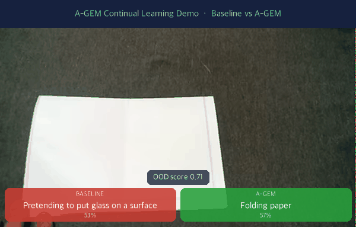

# coad-mini

[](https://huggingface.co/spaces/Yhoon-3/coad-mini)
[](https://stkangyh.github.io/coad-mini/)

**▶ [Try the live demo](https://yhoon-3-coad-mini.hf.space)** — webcam realtime captioning · few-shot action enrollment · OOD detection.

Compact continual-learning experiments for video action recognition on a 48-class subset of Something-Something V2. The project compares a plain sequential baseline against replay-based mitigation methods, mainly **A-GEM**, using **CLIP ViT-B/32 frame features** and a **GRU classifier**.



> *Realtime captioning demo: **Baseline** (left, red) vs **A-GEM** (right, green) on Something-Something V2, with a live OOD score. A-GEM correctly recognizes actions the sequentially-trained baseline mislabels (e.g. "Folding paper").*

> **📓 연구 일지 (Research Log)** — 실험 설계부터 최종 결과까지, 코드에 담기지 않은 의사결정 과정을 기록했습니다.  
> OrthGrad 가설 → 실패 → A-GEM 전환 → Scaling → Ablation → Demo 까지의 흐름을 담고 있습니다.  
> → **[docs/research_log.md](docs/research_log.md)**

## What this repository contains

- **Training scripts** for baseline sequential learning, stage-wise continual learning, and multi-seed analysis
- **A FastAPI demo app** for comparing Baseline vs A-GEM predictions on uploaded videos
- **Few-shot enrollment** of brand-new action classes (48 → 48+K) without catastrophic forgetting — see [docs/few_shot_enrollment.md](docs/few_shot_enrollment.md)
- **Anomaly / novel-action (OOD) detection** on the prediction stream — see [docs/anomaly_detection.md](docs/anomaly_detection.md)
- **Saved checkpoints** for the 48-class setup
- **Mini subset manifests** used by the experiments

## Applications

All reuse the same `CLIP features → GRU → A-GEM` core and are **wired into the FastAPI demo UI** (`GET /`):

- **Realtime captioning** — streaming per-window action prediction overlaid on an **uploaded video or a live webcam** (`POST /predict_rt`).
- **Anomaly / novel-action (OOD) detection** — an OOD-score badge on the realtime stream (turns red when an action looks out-of-distribution). Scoring (max-softmax-prob / entropy / energy) uses one convention — **higher score == more OOD** — with a calibrated threshold + temporal smoothing (`POST /predict_anomaly`). Calibrate: `python3 experiments/calibrate_anomaly.py --metric energy --target-fpr 0.05`. Details: [docs/anomaly_detection.md](docs/anomaly_detection.md).
- **Few-shot enrollment (continual-learning loop)** — a UI panel (label + example videos) registers a brand-new action class (48 → 48+K) via A-GEM replay without catastrophic forgetting, then **hot-swaps the serving model so the new action appears in the live caption immediately** and persists across restarts. Manage/reset enrolled actions via `GET /classes` · `POST /reset_classes` (`POST /enroll`). Demo: `python3 experiments/demo_few_shot.py`. Details: [docs/few_shot_enrollment.md](docs/few_shot_enrollment.md).

**Run the live demo:** `uvicorn app:app --port 8000`, or containerized via the included `Dockerfile` (Hugging Face Spaces-ready). See [docs/DEPLOY.md](docs/DEPLOY.md).

## Key findings

After A-GEM converged, we searched for the next bottleneck. **Data quantity dominates — not architecture:**

| Lever | Effect on Avg Acc |
|---|---|
| GRU capacity (256→512, +layers) | none / worse |
| Memory strategy (balanced/hard) | none |
| Backbone CLIP B/32 → OpenCLIP L/14 | +0.01–0.026 (vanishes at full data) |
| GRU → GRU+Attention | **−0.103** (forgetting +0.240) |
| **Training data 25% → 100%** | **+0.06–0.07** (still rising) |

Conclusion: a **simple GRU + A-GEM is the robust optimum**; scale data, not architecture. Reports: [openclip_l14](reports/openclip_l14_result.md) · [gru_attention](reports/gru_attention_result.md) · [data_scale](reports/data_scale_result.md). Full narrative: [docs/research_log.md](docs/research_log.md) §11.

## Method overview

The pipeline is:

`video -> 16 uniformly sampled frames -> CLIP ViT-B/32 embeddings -> GRU classifier -> staged continual-learning evaluation`

Current default setup:

- **48 classes**
- **8 stages x 6 classes**
- **16 sampled frames per video**
- **512-dim CLIP visual features**

## Repository layout

```text
coad-mini/
├── app.py                      # FastAPI demo server
├── config.py                   # Shared constants and path configuration
├── experiments/                # Training and analysis scripts
│   ├── train_baseline.py       # Single-pass baseline training
│   ├── train_stage.py          # Stage-based continual learning comparison
│   ├── run_stage_seeds.py      # Multi-seed baseline vs A-GEM
│   ├── run_capacity_ablation.py# Capacity / backbone / GRU+Attention sweep
│   ├── run_data_scale.py       # Data-fraction scaling (B/32 vs L/14)
│   ├── run_analysis.py         # A-GEM replay/memory ablations
│   ├── demo_few_shot.py        # Few-shot enrollment demo
│   ├── calibrate_anomaly.py    # Anomaly-score threshold calibration
│   └── save_checkpoints.py     # Train and save Baseline/A-GEM checkpoints
├── src/                        # Core library code
│   ├── models/
│   │   ├── gru_detector.py
│   │   └── gru_attention.py    # GRU + MultiheadAttention temporal model
│   ├── enroll/few_shot.py      # Few-shot new-class enrollment (A-GEM)
│   ├── anomaly/detector.py     # OOD / anomaly scoring
│   ├── utils/{gem.py, orthogonal_grad.py}
│   └── trainer.py              # Shared train/eval loops
├── tests/                      # pytest suites for the modules above
├── scripts/                    # Data preparation + feature extraction
├── docs/                       # GitHub Pages site + research log + module docs
├── reports/                    # Experiment result reports
├── checkpoints/                # baseline_48cls.pt, agem_48cls.pt, class_labels.json
└── data/subset/                # train_mini.json, val_mini.json
```

## Requirements

- Python 3.10+
- `ffmpeg` and `ffprobe` available on `PATH` for the FastAPI upload demo
- Access to the Something-Something V2 videos if you want to regenerate features

Install Python dependencies:

```bash
python3 -m venv .venv
source .venv/bin/activate
pip install -r requirements.txt
```

## Path configuration

The data-prep scripts no longer depend on hardcoded local paths. Set these environment variables when regenerating data:

```bash
export COAD_VIDEO_DIR=/path/to/20bn-something-something-v2
export COAD_LABELS_DIR=/path/to/labels
```

- `COAD_VIDEO_DIR` should contain the raw `.webm` videos
- `COAD_LABELS_DIR` should contain `train.json` and `validation.json`

## Quick start

### 1. Run the demo server with the included checkpoints

```bash
uvicorn app:app --host 0.0.0.0 --port 8000
```

Endpoints:

- `GET /` - demo UI
- `GET /health` - checkpoint/server status
- `GET /forgetting` - forgetting curves from saved checkpoints
- `POST /predict` - upload a video file
- `POST /predict_rt` - realtime frame-based inference
- `POST /predict_anomaly` - realtime inference + OOD/anomaly score
- `POST /enroll` - few-shot register a new action class (multipart: `label` + `files`); hot-swaps the live model
- `GET /classes` - list base + enrolled classes
- `POST /reset_classes` - remove enrolled actions, revert to the base 48

### 2. Recreate the mini subset manifests

```bash
python3 scripts/make_subset.py
python3 scripts/create_mini_subset.py
```

### 3. Extract CLIP features

```bash
python3 scripts/extract_clip_features.py
```

This writes per-video features under `data/features/{train,val}`.

### 4. Run experiments

```bash
# Simple baseline run
python3 experiments/train_baseline.py

# Stage-based continual learning
python3 experiments/train_stage.py

# Multi-seed comparison
python3 experiments/run_stage_seeds.py

# Save checkpoints for demo
python3 experiments/save_checkpoints.py
```

## GitHub Pages release

This repository includes a GitHub Pages site under `docs/` and an automatic deployment workflow:

- Workflow: `.github/workflows/pages.yml`
- Published URL: `https://stkangyh.github.io/coad-mini/`

If this is your first Pages deploy, open **Settings → Pages** in the repository and ensure:

- **Source** is set to **GitHub Actions**

## Included artifacts vs ignored artifacts

This repo is set up to be GitHub-friendly:

- **Included:** source code, mini subset manifests, small checkpoints, and project docs
- **Ignored:** local virtual environments, extracted feature tensors, cache files, and large regenerated subset exports

If you plan to publish the repository, commit the code and lightweight metadata, but avoid committing the full extracted feature directory.

## Notes

- The project currently contains both **A-GEM** and an older **OrthGrad / COAD** variant. The demo app and saved checkpoints focus on **Baseline vs A-GEM**.
- Training scripts expect the mini subset JSON files and extracted features to exist under `data/`.
