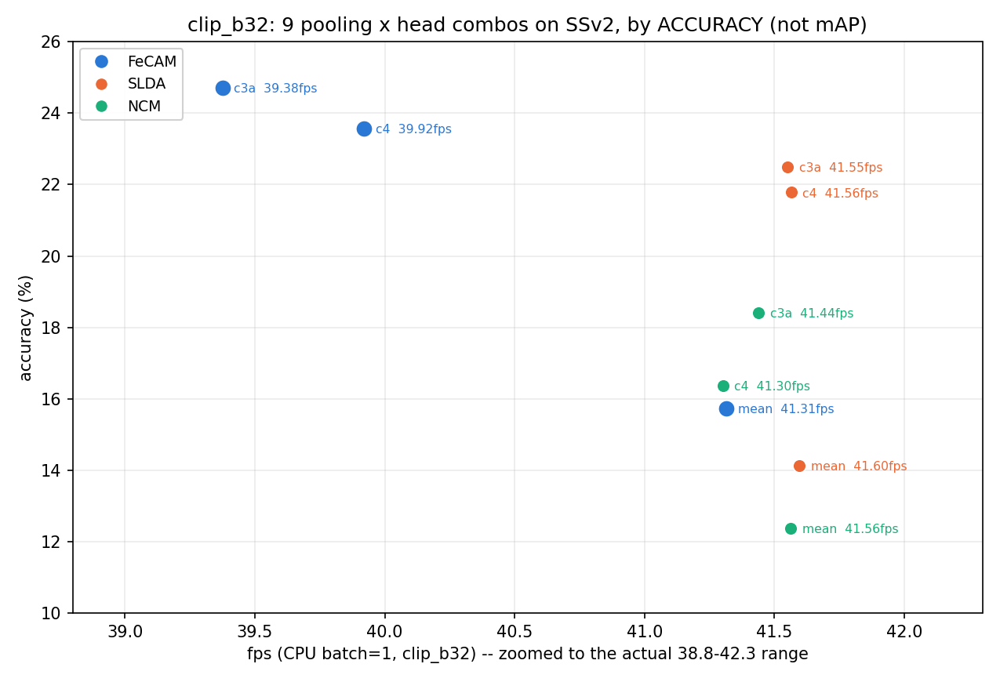

# 정확도와 속도(FPS)를 한 평면에 — CLIP B/32에서 9개 pooling×head 조합 중 무엇이 최선인가

Generated: 2026-08-06 (2026-08-08 세 차례 정정: Ridge-RLS 제외 → OpenCLIP L/14 제외 →
**주 지표를 mAP에서 정확도로 교체**, clip_b32 단독 스코프로 확정).
스크립트: [`dev/run_ap_fps_sweep.py`](../dev/run_ap_fps_sweep.py)
원시결과: `reports/ap_fps_sweep_raw.json`

**질문:** 지금 배포 중인 조합(CLIP B/32 + chunks4 + FeCAM)은 정말 Pareto-optimal인가?

**왜 이 실험이 필요했나:** 이 프로젝트는 지금까지 **축을 하나씩 따로** 최적화해왔다 —
pooling은 SSv2 정확도로 골랐고([`ssv2_pooling_protocol`](RESEARCH_LOG.md)), head는 pooling을
고정한 채 비교했고([`ssv2_head_curves_result.md`](ssv2_head_curves_result.md)), 속도는 배포 조합
하나만 쟀다([`realtime_incremental_result`](realtime_incremental_result.md)). 세 축을 한
평면에 올린 적이 없어서, 현재 배포 조합은 **세 번의 독립적인 1축 결정을 조립한 결과**일 뿐
"아무것도 이걸 동시에 이기지 못한다"가 검증된 적은 없었다.

**⭐ 08-08 세 번째 정정 — 왜 정확도로 바꿨나:** 이 리포트는 원래 mAP를 주 지표로 그래프를
그렸다. 그런데 "왜 top-1 대신 mAP를 썼냐"는 질문에 확인해보니 **근거가 없었다** — mAP는
`dev/compute_val_metrics.py`가 이미 쓰던 지표라 이 프로젝트에 없던 걸 새로 끌어온 건
아니지만, **이 프로젝트의 다른 모든 리포트(`ssv2_head_curves_result.md`,
`ucf101_tcd_result.md` 등)는 전부 정확도를 헤드라인으로 쓴다** — 이 리포트만 mAP를 메인
축으로 쓴 데에는 기록된 이유가 없었다. 그래서 본문을 정확도 기준으로 다시 짰다. mAP는
§6에 부차 지표로 남겨뒀다(측정 아티팩트를 발견했던 경위 자체는 그대로 기록 가치가 있어서).

## 0. 왜 이 조합(pooling × head, clip_b32 단독)인가

**backbone — clip_b32 하나로 고정한 이유(08-08 정정):** 원래 openclip_l14(768-d, LAION
학습)와 함께 2-backbone 비교로 설계했었다. 그런데 L/14가 프레임당 8배 느려서(196ms vs
24ms, CPU) 10fps 예산을 애초에 못 지킨다 — 배포 후보가 아닌 backbone을 계속 그래프에
남겨두는 건 이 리포트의 실제 질문과 무관한 잡음이라 뺐다. 원시 수치는
`ap_fps_sweep_raw.json`의 이전 실행분에 남아있다.

**pooling — mean/chunks4/chunks3+adjdiff, 3개뿐인 이유:** mean은 순서 정보가 없는 기준선,
chunks4는 배포 중인 pooling, chunks3+adjdiff는 `ssv2_pooling_protocol`이 held-out으로
뽑은 유일한 실질적 경쟁 후보(통계적으로 chunks4와 동률)다.

**head — NCM/SLDA/FeCAM, 3개인 이유(08-08 정정):** `cpu_friendly_methods_result.md`의
1세대 비교는 NCM/SLDA/**Ridge RLS** 세 개였는데, FeCAM 도입 후 이후 비교
(`ssv2_head_curves_result.md`, `pycil_bridge_result.md`)는 Ridge를 빼고
**NCM/SLDA/FeCAM**로 정착했다 — 처음 이 스윕을 만들 때 이 히스토리를 확인 안 하고
Ridge-RLS를 다시 넣었다가, 이미 은퇴시킨 head를 사용자 확인 없이 부활시킨 셈이 돼 빼고
다시 정리했다. (SLDA·FeCAM의 실제 차이가 무엇이고 왜 FeCAM이 이기는지는
[`fecam_vs_slda_covariance_result.md`](fecam_vs_slda_covariance_result.md)에서 ablation으로
정량 분해했다 — 89%가 공분산 정규화가 아니라 특징 전처리(Tukey+L2)에서 나온다.)

**FPS 모델:** [`realtime_incremental_result.md`](realtime_incremental_result.md)가 확립한
배포 경로 그대로 — ring buffer라 매 스텝 **새 프레임 1장만** 인코딩하고, 16프레임 버퍼를
pooling해서 채점한다. `fps = 1000 / (encode_1frame_ms + pool_ms + head_scores_ms)`,
**CPU·batch=1**(엣지 조건이자 스트리밍의 실제 조건).

---

## 1. 결과 — FeCAM이 3개 pooling 전부 승리

| pooling | NCM | SLDA | **FeCAM** | fps(FeCAM) |
|---|---|---|---|---|
| mean | 12.38% | 14.14% | **15.74%** | 41.31 |
| chunks4(배포) | 16.38% | 21.78% | **23.56%** | 39.92 |
| chunks3+adjdiff | 18.42% | 22.50% | **24.71%** | 39.38 |



**FeCAM > SLDA > NCM 순서가 3개 pooling 전부에서 예외 없이 유지된다** — 왜 이 순서가
나오는지는 §6에서 별도로 짚는다.

## 2. FPS는 인코더가 지배하고, 9개 조합 전부 예산 안이다

| 항목 | 프레임당 비용 | 비중 |
|---|---|---|
| CLIP B/32 인코딩 | 24.0 ms | **95%+** |
| pooling | 0.01~0.17 ms | 무시 가능 |
| head 채점(FeCAM, 최대 D=2560) | 0.17~1.35 ms | 최대 3% |

**pooling과 head를 아무리 바꿔도 fps는 39.4~41.6 범위 안에서만 움직인다** — 전부 10fps
예산(100ms/frame)의 4배 가까운 여유가 있다. **이 스코프(clip_b32 고정) 안에서는 fps가
배포 결정에 실질적 제약을 걸지 않는다** — 결정은 사실상 정확도만으로 내리면 된다.

## 3. 최선은 chunks3+adjdiff+FeCAM — 그런데 배포 근거는 아니다

| backbone | pooling | head | 정확도 | fps |
|---|---|---|---|---|
| clip_b32 | mean | SLDA | 14.14% | 41.60 |
| clip_b32 | chunks4 | SLDA | 21.78% | 41.56 |
| clip_b32 | chunks3+adjdiff | SLDA | 22.50% | 41.55 |
| clip_b32 | chunks4 | **FeCAM** | 23.56% | 39.92 |
| clip_b32 | chunks3+adjdiff | **FeCAM** | **24.71%** | 39.38 |

(무엇도 fps·정확도 둘 다 더 낫게 만들지 못하는 지점들 — Pareto frontier 전체)

9개 조합 중 정확도 최고는 **chunks3+adjdiff + FeCAM(24.71%, 39.38fps)**, 배포 중인
**chunks4 + FeCAM(23.56%, 39.92fps)**보다 **+1.15pp** 높다. fps 차이는 0.54로 무시할
수준이라, **속도 제약이 없는 이 스코프에서는 정확도 차이만 남는다** — 그런데 그 차이가
배포를 바꿀 근거가 되는지는 §4에서 다룬다(결론: 아니다).

## 4. ⚠️ chunks3+adjdiff가 chunks4보다 높게 나왔지만 — 바꾸면 안 된다

**이걸 근거로 배포 pooling을 바꾸는 건 정확히 자체 감사 2번이 경계했던 선택 편향이다.**

- 이 스윕은 **val에서 평가**했다. 반면 pooling 선택은 `run_ssv2_pooling_protocol.py`가
  **train을 fit/select로 쪼개 held-out으로** 골랐고(val은 건드리지 않음), 거기서 두 후보는
  **통계적으로 동률**이었다(44.87±3.40 vs 44.43±3.21 — 표준편차가 차이의 8배).
- 지금 val에서 보이는 +1.15pp는 그 동률 범위 **안**이다. 여기서 val 기준으로 갈아타면
  **val을 선택에 쓴 것**이 되어, 이후 val 수치의 의미가 사라진다.
- 게다가 이번 결과는 **단일 실행·시드 없음**이다 — pooling 프로토콜이 3시드로 오차막대를
  뽑았던 것과 비교 불가.

**결론: 현재 chunks4 유지가 옳다.** chunks3+adjdiff로 바꿀 근거가 되려면 **held-out
프로토콜을 다시 돌려서** 이겨야 한다.

## 5. 부수적 관찰 — head 순위가 pooling에 무관하게 고정된다

**FeCAM > SLDA > NCM** 순서가 **3개 pooling 전부**에서 예외 없이 유지된다.
[`fecam_vs_slda_covariance_result.md`](fecam_vs_slda_covariance_result.md)가 ablation으로
확인했듯, 이 우위의 89%는 FeCAM의 특징 전처리(Tukey 변환+L2 정규화)에서 나오고
공분산 정규화 자체의 기여는 11%뿐이다 — pooling이 바뀌어도(정보량이 바뀌어도) 이 우위가
안 흔들리는 건, 전처리 효과가 pooling 종류와 독립적으로 작동하기 때문으로 보인다(별도
검증은 안 함).

## 6. mAP — 측정하다 발견한 아티팩트 (부차 지표)

이 리포트를 처음 mAP 기준으로 만들면서, 순위(mAP)와 정확도(top-1) 결과가 **정반대로**
나오는 걸 발견했다 — mean pooling 기준 SLDA mAP=0.0383 > FeCAM mAP=0.0330(최하위)인데,
정확도는 FeCAM이 최고였다. FeCAM의 원시 점수(음의 마할라노비스 거리)는 샘플마다 절대
오프셋이 크게 다른데(행 평균 −1455~−278, 행 내부 편차는 4~14뿐), macro AP는 클래스 열
안에서 샘플을 줄 세우는 지표라 이 오프셋에 그대로 오염된 것 — top-1은 행 안에서 argmax만
보므로 이 오프셋에 면역이라 두 지표가 갈렸다. 채점 행렬을 행 z-score(샘플별 평균 0,
표준편차 1)로 정규화해 고쳤다(`mAP_raw`도 원시 JSON에 남김):

| pooling | NCM mAP | SLDA mAP | **FeCAM mAP** |
|---|---|---|---|
| mean | 0.0877 | 0.1008 | **0.1248** |
| chunks4 | 0.1199 | 0.1748 | **0.2152** |
| chunks3+adjdiff | 0.1395 | 0.1871 | **0.2220** |

수정 후에는 정확도와 같은 순서(FeCAM > SLDA > NCM)로 돌아온다 — 즉 이 아티팩트를 고치고
나면 mAP를 봐도 §1의 결론과 다르지 않다. mAP를 이 리포트의 메인 지표로 쓸 근거는 없었지만
(위 정정 참고), 이 아티팩트 자체는 "서로 다른 head를 AP로 비교할 때 점수 스케일 정규화가
왜 필수인지"를 보여주는 사례라 기록해뒀다.

## 7. 정직한 한계

- **backbone 비교는 이 리포트 범위 밖이다(§0).** "더 큰/다른 backbone이 정확도를 얼마나
  사는가"는 열린 질문으로 남아있다 — openclip_l14 원시 수치는 `ap_fps_sweep_raw.json`의
  이전 실행분에 남아있으니 필요하면 재구성 가능하다(단, 8배 느려 10fps 예산 밖이라는
  결론 자체는 바뀌지 않는다).
- **단일 실행, 시드 없음.** head는 전부 결정론적(닫힌 형태)이라 fit 자체는 재현되지만,
  클래스 순서를 바꿨을 때의 분산은 안 쟀다. 다만 FeCAM은 순서 무관 항등식이 이미
  확립돼 있어([`bounds_context_result.md §2`](bounds_context_result.md)) FeCAM 행에 대해서는
  이 한계가 적용되지 않는다.
- **SSv2 48클래스 subset만.** 174클래스 전체(이번 세션에 확보)로는 안 돌렸다.
- **인코더 타이밍은 이 맥(Apple Silicon) CPU 기준.** 절대 fps는 하드웨어에 따라 달라진다.
- **SLDA는 배치 fit으로 구현**했다(원본 스트리밍 구현은 O(N·D²)로 수분 소요). running
  mean/covariance라 최종 통계는 동일하고, 이 스크립트가 재는 건 **predict 시간**이라
  결론에 영향 없다.

## 재현

```bash
python3 dev/run_ap_fps_sweep.py --backbones clip_b32
```

```bash
python3 dev/run_ap_fps_sweep.py --backbones clip_b32 --skip-encoder-timing
```
