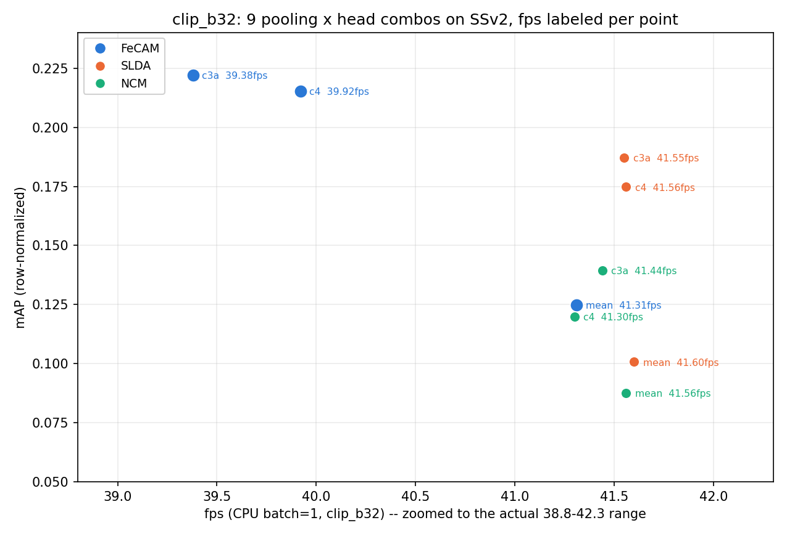

# 정확도(mAP)와 속도(FPS)를 한 평면에 — CLIP B/32에서 9개 pooling×head 조합 중 무엇이 최선인가

Generated: 2026-08-06 (2026-08-08 두 차례 정정: Ridge-RLS 제외 → OpenCLIP L/14 제외,
clip_b32 단독 스코프로 확정). 스크립트: [`dev/run_ap_fps_sweep.py`](../dev/run_ap_fps_sweep.py)
원시결과: `reports/ap_fps_sweep_raw.json`

**질문:** 지금 배포 중인 조합(CLIP B/32 + chunks4 + FeCAM)은 정말 Pareto-optimal인가?

**왜 이 실험이 필요했나:** 이 프로젝트는 지금까지 **축을 하나씩 따로** 최적화해왔다 —
pooling은 SSv2 정확도로 골랐고([`ssv2_pooling_protocol`](RESEARCH_LOG.md)), head는 pooling을
고정한 채 비교했고([`ssv2_head_curves`](ssv2_head_curves_result.md)), 속도는 배포 조합
하나만 쟀다([`realtime_incremental_result`](realtime_incremental_result.md)). 세 축을 한
평면에 올린 적이 없어서, 현재 배포 조합은 **세 번의 독립적인 1축 결정을 조립한 결과**일 뿐
"아무것도 이걸 동시에 이기지 못한다"가 검증된 적은 없었다.

## 0. 왜 이 조합(pooling × head, clip_b32 단독)인가

**backbone — clip_b32 하나로 고정한 이유(⭐ 08-08 정정):** 원래 openclip_l14(768-d, LAION
학습)와 함께 2-backbone 비교로 설계했었다. 그런데 그 비교의 결론은 명확했다 — L/14가
프레임당 8배 느려서(196ms vs 24ms, CPU) 10fps 예산을 애초에 못 지킨다. **배포 후보가
아닌 backbone을 계속 그래프에 남겨두는 건 이 리포트의 실제 질문("배포 조합이
Pareto인가")과 무관한 잡음**이라 빼기로 했다 — L/14 비교 자체가 무의미했던 게 아니라,
"두 backbone 중 뭐가 나은가"가 **이 리포트의 질문이 아니었다**는 걸 뒤늦게 확인한 것.
원시 수치는 `ap_fps_sweep_raw.json`에 남아있어 필요하면 언제든 다시 꺼낼 수 있다.

**pooling — mean/chunks4/chunks3+adjdiff, 3개뿐인 이유:** mean은 순서 정보가 없는 기준선,
chunks4는 배포 중인 pooling, chunks3+adjdiff는 `ssv2_pooling_protocol`이 held-out으로
뽑은 유일한 실질적 경쟁 후보(통계적으로 chunks4와 동률)다. 이 셋이 "지금 실제로 후보인
pooling 전부"라 더 늘릴 이유가 없었다.

**head — NCM/SLDA/FeCAM, 3개인 이유(⭐ 08-08 정정):** 이건 새로 고른 게 아니라 **이
프로젝트가 이미 한 번 정리해둔 세트를 그대로 재사용**한 것이다. `cpu_friendly_methods_result.md`의
1세대 비교는 NCM/SLDA/**Ridge RLS** 세 개였는데, FeCAM(공유 공분산 + shrinkage 정규화 +
few-shot correction)이 모든 지표에서 더 낫다는 게 확인되면서 이후 비교는 Ridge를 빼고
**NCM/SLDA/FeCAM**로 정착했다 — 같은 8-stage SSv2 프로토콜로 돌린
[`ssv2_head_curves_result.md`](ssv2_head_curves_result.md)가 avg_inc
NCM 0.209 < SLDA 0.228 < FeCAM 0.242로 이미 이 순서를 확인했고, `pycil_bridge_result.md`의
CIFAR-100 브리지 실험(avg-inc NCM 0.698 < SLDA 0.725 < FeCAM 0.769)도 같은 순서다 —
NCM(공분산 없음) < SLDA/FeCAM(둘 다 공유 공분산 사용, 정규화 방식이 다름 — 코드 확인
결과 SLDA는 등방 shrinkage 0.01, FeCAM은 상관계수 기반 비대칭 shrinkage 1.0,
`ssv2_head_curves_result.md §3` 참고)이 두 데이터셋에서 독립적으로 재현된 순서다. 처음
이 스윕을 만들 때 이 히스토리를 확인 안 하고 Ridge-RLS를 다시 넣었다가,
이미 은퇴시킨 head를 사용자 확인 없이 부활시킨 셈이 돼 빼고 다시 정리했다.

**FPS 모델:** [`realtime_incremental_result.md`](realtime_incremental_result.md)가 확립한
배포 경로 그대로 — ring buffer라 매 스텝 **새 프레임 1장만** 인코딩하고, 16프레임 버퍼를
pooling해서 채점한다. `fps = 1000 / (encode_1frame_ms + pool_ms + head_scores_ms)`,
**CPU·batch=1**(엣지 조건이자 스트리밍의 실제 조건 — 배치 처리량을 쓰면 인코더가 실제보다
2배 빨라 보인다).

---

## 1. ⚠️ 먼저 — 하마터면 틀린 결론을 낼 뻔했다 (측정 아티팩트)

첫 실행 결과는 mAP 순위와 top-1 정확도 순위가 **정반대**였다(mean pooling 기준):

| head | mAP(원시) | 정확도 |
|---|---|---|
| SLDA | 0.0383 | 0.1414 |
| FeCAM | **0.0330** (최하위) | **0.1574** (1위) |

**수상한 지점:** FeCAM의 mAP가 pooling을 뭘 바꿔도 0.028~0.033에서 **거의 안 움직였다** —
같은 조건에서 정확도는 0.157 → 0.247로 올랐는데. 이 불일치가 힌트였다.

**원인:** macro AP는 **각 클래스 열 안에서 샘플들을 줄세운다**. 그런데 FeCAM의 점수는 음의
마할라노비스 거리라 **샘플마다 절대 스케일이 다르다** — 실측해보니 행 평균이 −1455 ~ −278로
**오프셋 편차가 1176**인데 행 내부 편차는 4.5~14.3뿐이었다. 즉 원시 AP는
*"이 샘플이 클래스 c인가"*가 아니라 ***"이 샘플이 전반적으로 모든 클래스에서 먼가"*** 를
재고 있었다. top-1 정확도는 행 내부 argmax라 이 오프셋에 **완전히 면역**이라, 두 지표가
정반대로 나온 것.

**수정:** 채점 행렬을 **행 z-score**(샘플별로 클래스 축을 표준화)한 뒤 AP를 계산한다. argmax가
안 바뀌므로 **정확도는 그대로**고, 모든 head에 **동일하게** 적용하므로 "각 head가 우연히 가진
점수 스케일"이 아니라 **랭킹 품질 자체**를 비교하게 된다. FeCAM mAP 0.0330 → **0.1248**(mean 기준).

`mAP_raw`도 raw JSON에 함께 남겼다 — 아티팩트가 보이도록.

**교훈:** 서로 다른 head를 AP로 비교할 때 **점수 스케일 정규화는 선택이 아니라 필수**다.
정확도만 봤으면 이 함정 자체를 못 봤을 것이고, AP만 봤으면 **정반대 결론**을 냈을 것이다.

## 2. 결과 — FeCAM이 3개 pooling 전부 승리

| pooling | NCM | SLDA | **FeCAM** | fps(FeCAM) |
|---|---|---|---|---|
| mean | 0.0877 | 0.1008 | **0.1248** | 41.3 |
| chunks4(배포) | 0.1199 | 0.1748 | **0.2152** | 39.9 |
| chunks3+adjdiff | 0.1395 | 0.1871 | **0.2220** | 39.4 |

(정확도: mean 0.1574 / chunks4 0.2356 / chunks3+adjdiff 0.2471 — 순서는 mAP와 동일)



## 3. FPS는 인코더가 지배하고, 9개 조합 전부 예산 안이다

| 항목 | 프레임당 비용 | 비중 |
|---|---|---|
| CLIP B/32 인코딩 | 24.0 ms | **95%+** |
| pooling | 0.01~0.17 ms | 무시 가능 |
| head 채점(FeCAM, 최대 D=2560) | 0.17~1.35 ms | 최대 3% |

**pooling과 head를 아무리 바꿔도 fps는 39.4~41.6 범위 안에서만 움직인다** — 전부 10fps
예산(100ms/frame)의 4배 가까운 여유가 있다. `realtime_incremental_result.md`의 "인코더가
91%"와 같은 방향인데, 여기선 head 비용이 최대여도(FeCAM, D=2560) 인코더 대비 5% 안쪽이라
더 극단적으로 확인된다. **이 스코프(clip_b32 고정) 안에서는 fps가 배포 결정에 실질적
제약을 걸지 않는다** — 결정은 사실상 mAP만으로 내리면 된다.

## 4. 최선은 chunks3+adjdiff+FeCAM — 그런데 배포 근거는 아니다

9개 조합 중 mAP 최고는 **chunks3+adjdiff + FeCAM(0.2220, 39.4fps)**, 배포 중인
**chunks4 + FeCAM(0.2152, 39.9fps)**보다 +0.0068 높다. fps 차이는 0.5로 무시할 수준이라,
**속도 제약이 없는 이 스코프에서는 mAP 차이만 남는다** — 그런데 그 차이가 배포를 바꿀
근거가 되는지는 §5에서 별도로 다룬다(결론: 아니다).

## 5. ⚠️ chunks3+adjdiff가 chunks4보다 높게 나왔지만 — 바꾸면 안 된다

**이걸 근거로 배포 pooling을 바꾸는 건 정확히 자체 감사 2번이 경계했던 선택 편향이다.**

- 이 스윕은 **val에서 평가**했다. 반면 pooling 선택은 `run_ssv2_pooling_protocol.py`가
  **train을 fit/select로 쪼개 held-out으로** 골랐고(val은 건드리지 않음), 거기서 두 후보는
  **통계적으로 동률**이었다(44.87±3.40 vs 44.43±3.21 — 표준편차가 차이의 8배).
- 지금 val에서 보이는 +0.68pp(mAP 기준)는 그 동률 범위 **안**이다. 여기서 val 기준으로
  갈아타면 **val을 선택에 쓴 것**이 되어, 이후 val 수치의 의미가 사라진다.
- 게다가 이번 결과는 **단일 실행·시드 없음**이다 — pooling 프로토콜이 3시드로 오차막대를
  뽑았던 것과 비교 불가.

**결론: 현재 chunks4 유지가 옳다.** chunks3+adjdiff로 바꿀 근거가 되려면 **held-out
프로토콜을 다시 돌려서** 이겨야 한다.

## 6. 부수적 관찰 — head 순위가 pooling에 무관하게 고정된다

**FeCAM > SLDA > NCM** 순서가 **3개 pooling 전부**에서 예외 없이 유지된다. §0에서 정리한
"공분산을 쓰는가(SLDA/FeCAM) vs 안 쓰는가(NCM)"의 구분과, SLDA/FeCAM 사이의 정규화 방식
차이가 pooling이 바뀌어도(정보량이 바뀌어도) **순서 자체는 안 흔들리는 안정적 성질**이라는
뜻 — pooling을 바꿔가며 head를 재선택할 필요는 없다.

## 7. 정직한 한계

- **backbone 비교는 이 리포트 범위 밖이다(§0).** "더 큰/다른 backbone이 mAP를 얼마나
  사는가"는 열린 질문으로 남아있다 — openclip_l14 원시 수치는 `ap_fps_sweep_raw.json`의
  이전 실행분에 남아있으니 필요하면 재구성 가능하다(단, 8배 느려 10fps 예산 밖이라는
  결론 자체는 바뀌지 않는다).
- **단일 실행, 시드 없음.** head는 전부 결정론적(닫힌 형태)이라 fit 자체는 재현되지만,
  클래스 순서를 바꿨을 때의 분산은 안 쟀다. 다만 FeCAM은 순서 무관 항등식이 이미
  확립돼 있어([`bounds_context_result.md §2`](bounds_context_result.md)) FeCAM 행에 대해서는
  이 한계가 적용되지 않는다.
- **SSv2 48클래스 subset만.** 174클래스 전체(이번 세션에 확보)로는 안 돌렸다 — 기존 pooling·head
  결과들과 비교 가능하도록 48클래스를 유지했다.
- **인코더 타이밍은 이 맥(Apple Silicon) CPU 기준.** 절대 fps는 하드웨어에 따라 달라진다.
- **SLDA는 배치 fit으로 구현**했다(원본 스트리밍 구현은 O(N·D²)로 수분 소요). running
  mean/covariance라 최종 통계는 동일하고, 이 스크립트가 재는 건 **predict 시간**이라
  결론에 영향 없다.

## 재현

```bash
python3 dev/run_ap_fps_sweep.py --backbones clip_b32
```

```bash
python3 dev/run_ap_fps_sweep.py --backbones clip_b32 --skip-encoder-timing
```
