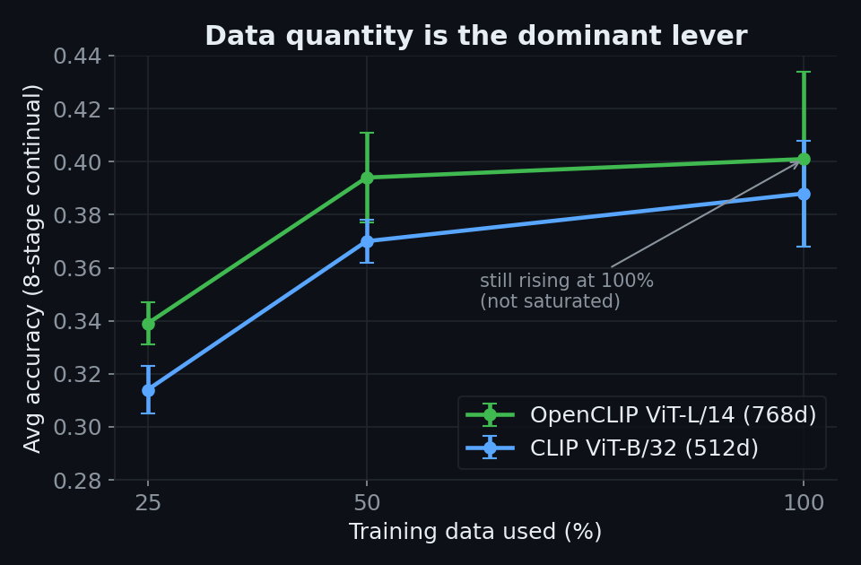

# 데이터 규모 스케일링 결과 (B/32 vs L/14)

Generated: 2026-06-07 (auto)

## 질문

backbone 효과(CLIP B/32 vs OpenCLIP L/14)가 **데이터 양이 적어서 가려진 것**인가?
→ 동일 영상을 25% / 50% / 100%로 줄여가며 두 backbone을 비교. subsample은
seed+fraction 기반으로 backbone과 무관하게 동일(공정 비교 보장).

## 설정

```text
A-GEM (balanced, mem=50, replay=0.25), GRU hidden=256
48 classes / 8 stages / 15 epochs / seeds 0 1 2
fractions = 0.25, 0.5, 1.0
```

## 결과 (Avg Acc, 3-seed mean ± std)



| 데이터 | B/32 (512d) | L/14 (768d) | Δ (L14−B32) |
|---|---|---|---|
| 25%  | 0.314 ± 0.009 | 0.339 ± 0.008 | **+0.026** |
| 50%  | 0.370 ± 0.008 | 0.394 ± 0.017 | **+0.024** |
| 100% | 0.388 ± 0.020 | 0.401 ± 0.033 | **+0.013** |

데이터 증가에 따른 상승폭 (25%→100%):
- B/32: +0.074
- L/14: +0.062

## 해석

1. **데이터 양이 압도적으로 가장 큰 레버.**
   - 데이터 25%→100%: **+0.06~0.07**
   - Backbone B/32→L/14: +0.01~0.026
   - GRU 용량 / Attention: 0 또는 악화
   데이터가 backbone·아키텍처보다 ~3–7배 큰 개선을 준다.

2. **"데이터가 적어 backbone 효과가 가려졌다" 가설은 기각.**
   격차는 데이터가 늘수록 **벌어지지 않고 오히려 좁혀짐** (+0.026 → +0.013).
   즉 L/14 우위는 **저데이터 현상**이고, 데이터가 충분하면 단순 B/32가 따라잡는다.
   → 더 많은 영상을 추출해도 L/14 우위가 극적으로 커지진 않을 것.

3. **두 곡선 모두 100%에서 아직 상승 중** (B/32 50%→100% +0.017).
   완전 saturation 전 → mini subset보다 더 많은 데이터를 쓰면 **두 backbone 모두
   계속 개선될 여지**가 있다 (특히 B/32).

## 결론 / 권고

```text
GRU 용량        ❌
Memory 전략     ❌
Feature backbone ⚠️ 저데이터에서만 소폭, 고데이터서 소멸
Temporal 복잡도  ❌ (Attention 악화)
데이터 규모      ⭕ 지배적 레버, 곡선 아직 상승 중
```

- 다음 진짜 레버는 backbone/아키텍처가 아니라 **학습 데이터 규모 확대**.
- 모델 측은 **단순 GRU + A-GEM(balanced, mem=50)을 main으로 고정**.
- backbone은 B/32로 충분 (L/14의 고데이터 이득이 미미·노이즈 범위). 추가 추출 비용 대비 효용 낮음.
- 결론용 비교는 3-seed ±0.02~0.03 분산 → 작은 효과 검정엔 seed 5+ 권장.
