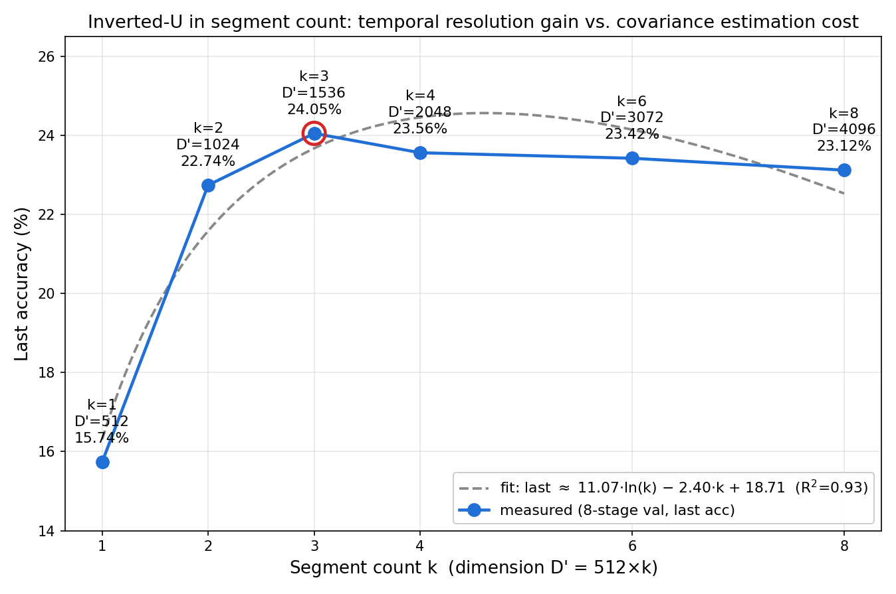
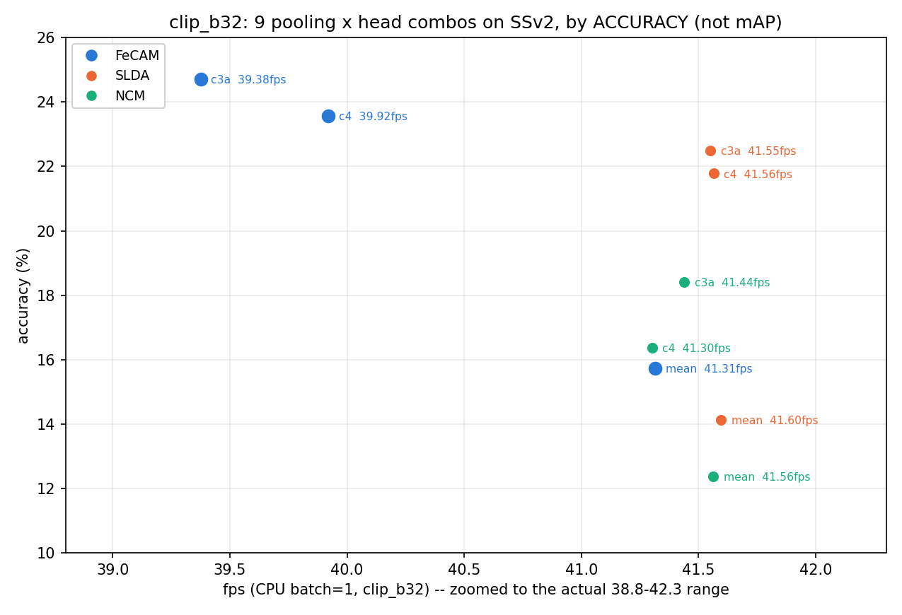

# OPTP: CPU-efficient Incremental Video Recognition with Order-preserving Temporal Pooling

> 논문 제목 확정(2026-08-27, 사용자 편집본). 이 문서는 개요/근거 정리용이고,
> **실제 §1~4 LaTeX 논문 본문은 [`paper_draft.tex`](paper_draft.tex)**. §5(Conclusion)는
> 아직 작성 안 함(사용자 지시).

Generated: 2026-08-20, 2026-08-27 사용자 편집본 반영. Notion 개요(`Title (논문 작성)`)의
**비어있던 섹션**을 기존 검증 리포트 근거로 채운 것. 새 실험 없음 — 전부 기존 수치 재구성.

**표기 규칙**
- 각 항목 끝의 `[파일명]`은 그 주장의 근거 리포트.
- ⚠️ 표시는 **아직 실험되지 않았거나 근거가 없는 항목** — 그대로 쓰면 안 되고, 실험하든
  문장을 빼든 결정이 필요한 지점.

---

## ✅ 해결됨 — overlap 실험 완료, 채택 안 함

개요의 Introduction("overlap이 중요")과 §4.2 Ablation("overlap 유무")에 overlap이
들어있었는데, 당시엔 **이 프로젝트에 overlapping pooling 구현이 없어서** 근거 없는
주장이었다. 이후 직접 구현·실험함:
[`overlap_pooling_result.md`](overlap_pooling_result.md) — **overlap은 도움이 안
되고, 오히려 커질수록 단조적으로 나빠진다**(k=3: 0.0→2.0 overlap에서 −4.01pp/1.26×sd,
k=4: −2.80pp/0.86×sd, 5개 overlap 값 전부 하락 방향 일관). 작은 overlap(0.25)은 T=16
프레임 해상도 한계로 아예 무효과였다(양자화 artifact).

**결론: Introduction·Ablation에서 overlap 문장은 빼는 게 맞다** — "시도했으나 채택 안 함"을
각주 한 줄로 남기는 정도가 적절하다(아래 §3.3(g), §4.2(g), §5에 반영).

---

# 1. Introduction

> Notion 원본에 이미 있던 불릿(CIL/Video CIL/CPU-only CIL이 왜 중요한가, 기존 연구의
> 한계, 핵심 아이디어)을 근거와 함께 채운 것. 이 대화 중 "Video CIL가 왜 중요할까?"·
> "CIL 자체는 왜 필요할까"에 답했던 내용을 여기로 옮기고 인용을 붙였다.

**(a) CIL이 왜 필요한가**
- 배포된 모델이 새 클래스를 배워야 할 때, 매번 전체 데이터를 모아 처음부터 재학습하는
  방식은 두 가지로 막힌다: 과거 데이터를 다시 못 보는 경우가 많고(저장 정책·프라이버시·
  스트리밍 소스), 설사 데이터가 있어도 재학습 비용이 계속 불어난다.
- 이 프로젝트가 실측한 비용 차이가 두 번째 이유를 구체적 수치로 보여준다: FeCAM의
  닫힌 형태 갱신은 **42.4ms**, backprop 기반 재학습(GRU+A-GEM)은 **270초** — 약
  **6,400배** [`cpu_friendly_methods_result.md`]. 새 클래스 하나 등록하는 데 몇 분씩
  파이프라인이 멈춘다면 배포 자체가 성립하지 않는다.
- CIL은 이 문제를 "과거 클래스를 잊지 않으면서 새 클래스만 추가 학습"으로 푸는 문제
  설정이다.

**(b) 어디에 중요한가 — edge 배포**
- 로봇·스마트글래스·IoT 카메라처럼 현장에 배치되는 기기는 제약이 겹친다: 클라우드
  연동이 항상 가능하지 않고(네트워크·지연·프라이버시), 기기 자체 연산력이 GPU 없이
  CPU뿐이며, 배포 전에 인식해야 할 클래스 전체를 미리 알 수 없다.
- 기존 edge CL 문헌은 이 제약을 주로 **"메모리 예산"으로만 정의**하고 연산·시간 축은
  향후 과제로 남겨둔다 [`pycil_survey_edge_gap.md`] — 이 갭이 이 논문의 출발점이다
  (§2.2에서 상술).

**(c) Video CIL이 이미지 CIL보다 어려운 이유**
- 이미지 한 장으로는 원리적으로 판단할 수 없는 정보가 있다 — "무엇이 움직였는가/어느
  방향인가"는 정지 프레임 하나로는 알 수 없다. SSv2의 "왼쪽→오른쪽 밀기" vs "오른쪽→
  왼쪽 밀기"가 그 예: 개별 프레임만 보면 구별 불가능하고 시간 순서를 봐야만 구별된다
  (§3.3(a)에서 직접 재현·수치화).
- 그래서 video CIL은 (1) class-incremental이라는 CIL의 일반 문제에 (2) 시간축 정보를
  어떻게 보존·활용할지의 문제가 곱해진, 더 어려운 세팅이다.

**(d) 지금까지 연구들의 한계 — 세 계열이 각각 조건을 하나씩 어긴다**
- 비디오 CIL 계열(TCD/STSP/CSTA/ESSENTIAL)은 시간축을 다루지만 전부 **GPU 학습을
  전제**하고 wall-clock 시간을 보고하지 않는다 [`sota_positioning_brief.md §1(f)`, §2.1(e)].
- CPU-friendly/backprop-free CIL 계열(SimpleCIL/RanPAC/SLDA/FeCAM)은 GPU가 필요
  없지만 전부 **정적 이미지 벤치마크**(CIFAR-100 등)에서만 검증됐다
  [`pycil_bridge_result.md §5`, §2.2(a)(b)].
- edge CL 서베이는 제약을 명시적으로 다루지만 **메모리 축에만 집중**하고 비디오를
  다루지 않는다 [`pycil_survey_edge_gap.md`, §2.2(c)].
- → 세 계열의 교집합("비디오 + CPU-only + 실시간 처리율 예산")이 비어있다(§2.2(d) 표).

**(e) 이 논문의 핵심 아이디어**
- frozen CLIP(파인튜닝 0회) 위에 두 요소만 얹는다: (1) 시간 순서를 보존하는 닫힌 형태
  pooling, (2) FeCAM 공유 공분산 head.
- ⚠️ **원래 아이디어 중 하나(구간을 겹치게 하는 overlap pooling)는 실험해보니 틀렸다.**
  겹치는 구간은 이웃 구간의 내용을 서로 닮게 만들어 오히려 mean-pool 방향으로
  후퇴시키고, overlap이 커질수록 정확도가 단조 하락했다(k=3 −4.01pp, k=4 −2.80pp)
  [`overlap_pooling_result.md`, §3.3(g)/§4.2(g)]. 실제로 도움이 된 건 겹침이 아니라
  **구간을 나눠 각자 자기 자리를 갖게 하는 것**(순서 보존, §3.3(a)(d))과 **구간 수를
  3~4개로 맞추는 것**(§3.3(e))이었고, 인접 구간 간 차분(adjacent diff)을 더하는 효과는
  **구간 수 3에서는 뚜렷하지만 4에서는 불확실**하다는 것까지 새로 확인했다(§3.4(b)/§4.2(f)).
- pooling도 head도 **파라미터 0개·gradient 0회** — "배포 후 학습 없음"을 유지한 채
  SSv2에서 mean-pool 대비 **+7.83pp**를 회복한다(§3.3, §4.2(d)(e)).
- FeCAM은 그냥 가져다 쓴 게 아니라, SLDA보다 나은 이유를 요인 분해까지 했다 — 이득의
  89%는 정규화가 아니라 특징 전처리에서 온다(§3.2(c)/§4.2(h)).

---

# 2. Related Works

## 2.1. CIL for Video Recognition

**(a) 비디오 CIL 벤치마크의 성립** [`sota_positioning_brief.md §1(c)`]
- vCLIMB(CVPR'22)가 UCF101 / ActivityNet / Kinetics를 묶어 비디오 CIL 벤치마크를 정의.
  메모리를 "프레임 수"로 회계하는 관례를 세움 — 비디오 CIL에서 메모리 정의가 이미지와
  다르다는 문제의식.
- TSN+ResNet-34 baseline: UCF101 iCaRL 81.0 / Kinetics 32.0.

**(b) SSv2를 CIL 벤치로 쓴 계보 — 우리 데이터셋 선택과 직접 겹침** [`sota_positioning_brief.md §1(f)`]
- 네 편이 **완전히 동일한 split**(174클래스, 84 base + 10×9 / 5×18)으로 보고하므로
  하나의 계보로 묶어 서술하는 게 자연스럽다. **CIVC(2021)는 이보다 이르지만 별도의
  40클래스 소규모 split**을 써서 직접 비교는 안 되지만, "SSv2는 방향성이 본질"이라는
  §1(c)의 문제의식을 우리와 독립적으로 공유하는 원조격 논문이라 참고로 추가한다.

| 논문 | 발표 | exemplar | 백본 | SSv2 (10×9 / 5×18) |
|---|---|---|---|---|
| TCD (arXiv:2203.13611) | ICCV 2021 | 20/class | ResNet-50+TSM, CIL 내내 fine-tune | 35.78 / 29.60 |
| CIVC (arXiv:2106.15827) | ACM MM 2021 | 5/class(video)+key-frame | TSM-ResNet50, **motion trajectory 기반 spatio-temporal 분해 후 증류** | 46.30(자체 40cls split)‡ |
| STSP (ECCV 2024) | ECCV 2024 | **0** | ResNet-50+TSM, gradient를 옛 특징 null space로 투영 | **69.68 / 70.87** |
| CSTA (arXiv:2501.07236) | 2025 | 0(주 학습)/5(FT, 헤드라인 수치에 포함)† | TimeSformer + 공간·시간 분리 어댑터 | 41.26 / — |
| ESSENTIAL (arXiv:2508.10896) | ICCV 2025 Highlight | sparse+학습형 prompt | **frozen CLIP** + 학습형 temporal encoder | 48.9 / 47.5 |

> **2026-08-27 재배치**: CIVC를 TCD 바로 다음(2번째 행)으로 옮김 — 둘 다 2021년,
> exemplar-replay 계열이라 시간순+계열별로 묶이게. STSP/CSTA/ESSENTIAL(2024~2025)은
> 그 뒤에 그대로 이어짐.

‡ CIVC는 TCD와 다른 SSv2 분할(40클래스 부분집합, 20 base+20 incremental/5세션)을 써서
위 10×9/5×18 수치와 직접 비교 불가 — 값보다 **자체 ablation**이 의미 있다: fused(baseline)
40.79 → decomposed 45.87 → **decomposed+trajectory 46.30**. "시간 정보를 합치지 말고
분해해서 다뤄야 한다"를 지식증류 단계에서 실측한 것으로, 우리가 pooling 단계에서
실측한 것(§4.2(d))과 같은 결론을 다른 파이프라인 지점에서 독립적으로 뒷받침한다. 원문도
§1(c)와 같은 예시를 쓴다: *"Something-Something V2 dataset incorporates concepts of
left and right, e.g., pulling something from left to right and pulling..."*

† **CSTA는 "exemplar-free"를 제목·초록에 내세우지만(2026-08-21, 원문 §IV-A 직접 재확인
완료), 실제로는 태스크마다 학습 후 별도 fine-tuning 단계에서 실제 샘플을 쓴다.** 원문
인용: *"During fine-tuning, we randomly select 5 examples from each class in previous
tasks to construct a balanced fine-tuning set, aligning with the definition in the TCD
Benchmark. During the fine-tuning period, the classifier is tuned while the feature
extractor remains frozen."* 즉 (1) 이전 클래스당 실제 샘플 5개 — TCD와 동일한 정의를
그대로 차용, (2) 튜닝 대상은 classifier뿐(feature extractor는 고정), (3) **이 절차가
Table I 헤드라인 SOTA 수치(위 41.26 포함)에 기본 포함**돼 있다 — 저장용량 표(Table V)도
이 버전을 아예 "CSTA(FT)"로 이름 붙이고 "even with the inclusion of the fine-tuning
process, storage remains modest"라며 포함 사실을 스스로 인정한다. 예외는 §IV-D
challenging-setting 테스트 단 하나뿐 — 거기서만 명시적으로 "without fine-tuning"이라고
밝히고 뺐다. (5개가 원본 비디오인지 특징인지는 원문 미명시 — feature extractor를 얼린
채 classifier만 튜닝한다는 점, 저장용량이 video-replay 방식인 SMILE 대비 훨씬 작다는
점으로 볼 때 feature 저장일 가능성이 높지만 이건 추론이지 원문이 직접 밝힌 건 아니다.)

**(c) 이 계보를 관통하는 축 = 우리와의 근본적 차이 (Related Works의 핵심 문장)**
- TCD·STSP·CSTA·CIVC는 **SSv2 영상으로 백본을 실제 학습/적응**한다(전체 gradient
  업데이트+제약, 어댑터 학습, 또는 CIVC의 경우 지식증류). 이 계열의 feature는 전부
  **SSv2 모션에 노출되어 학습된 표현**이다.
- ESSENTIAL만 frozen CLIP을 쓰지만, 그 위에 **학습형 temporal encoder(Transformer)를
  SSv2로 훈련**해 얹는다.
- → **다섯 편 모두 "표현을 대상 도메인으로 학습시키는" 트랙**이고, 우리는 **한 번도 대상
  도메인을 본 적 없는 frozen 표현** 트랙이다. 이 경계를 Related Works에서 명확히 그어야
  §4.2의 숫자 비교가 정직해진다.

**(d) TCD의 NME 경고 — 정면으로 다뤄야 할 긴장** [`sota_positioning_brief.md`, `base_heavy_split_result.md`]
- TCD 원문: SSv2에서 NME(prototype 분류기, 우리 FeCAM과 정신이 유사)가 CNN보다 6.9~8.0%p
  낮고, *"naïve averaging of the features from all frames may not be suitable"* 이라고 명시.
- 우리는 정반대 결론("mean-pool FeCAM이 GRU를 이긴다")을 내므로 이 긴장을 회피하면 안 됨.
- **우리 반박 논리(§3.3과 연결):** TCD의 feature는 SSv2로 학습되어 **모션 정보를 담고 있는**
  feature다 — 그걸 평균내면 그 정보가 파괴된다. 우리 frozen CLIP feature에는 애초에
  **평균내서 잃을 학습된 시간 정보가 없다.** 그래서 TCD의 경고가 구조적으로 덜 적용된다.
- 이 논리를 말로만 두지 않고 **base-heavy split으로 직접 재검증**했다 — 반전 없음, 오히려
  격차 확대. (§4.2에서 수치로 제시)

**(e) 이 계열이 보고하지 않는 것 = 우리 갭의 절반**
- 위 다섯 편 중 **어느 것도 wall-clock 학습 시간이나 CPU 추론 처리율을 보고하지 않는다**
  [`ap_fps_sweep_result.md`에서 확인한 "CIL 문헌은 시간을 안 잰다" 패턴]. CIVC는 원문 전체를
  검색해도 wall-clock·FPS·latency 언급이 전무하고 "Mem.(G)"만 보고한다(2026-08-23 원문
  재확인) — 나머지 넷과 같은 패턴.
- 전부 GPU 학습을 전제한다 → §2.2의 갭으로 연결.

## 2.2. CIL for CPU-only Edge Devices

> **2026-08-27 편집 — 사용자가 축소함.** 원래 있던 (a) PTM-frozen/rehearsal-free 이미지
> CIL(L2P/DualPrompt/CODA-Prompt/SimpleCIL/APER/RanPAC)과 (b)의 FoRo/CMA-ES 캐비앗을
> 통째로 뺐다 — 논문 흐름상 SLDA/FeCAM 직계 계열 + edge 제약 문헌 두 덩어리만 남기는
> 게 더 간결하다고 판단한 것으로 보임. 원래 내용은 git 히스토리에 남아있어 필요하면
> 복원 가능. 아래는 축소된 버전.

**(a) 닫힌 형태(closed-form) / 스트리밍 계열 — 우리 head의 직계** [`cpu_friendly_methods_result.md`, `fecam_vs_slda_covariance_result.md`]
- SLDA(Hayes & Kanan, CVPR-W'20): 스트리밍 평균 + **하나의 공유 공분산**. 공유 공분산은
  FeCAM의 발명이 아니라 이쪽이 3년 먼저.
- FeCAM(Goswami et al., NeurIPS'23, arXiv:2309.14062): Tukey 전처리 + 데이터 기반 shrinkage.

**(b) edge 제약을 명시적으로 다룬 연구 — 그리고 그들이 남긴 갭** [`pycil_survey_edge_gap.md`]
- Zhou et al., "Class-Incremental Learning: A Survey"(arXiv:2302.03648, **TPAMI**,
  PyCIL 저자 그룹의 표준 서베이) — **edge를 "메모리 예산"으로만 정의**하고, 연산·시간
  축은 Future Directions로 넘김. dynamic network는 edge에 부적합하다고 명시.
  ⚠️ 이전에 "(IJCAI'24)"로 잘못 적혀있던 걸 원문 확인해서 TPAMI로 정정함.
- SparCL(NeurIPS'22): 실제 폰 CPU 학습 실측이 존재하는 드문 사례.

**(c) 우리 접근** — 이미 확립된 계열 중 가장 가벼운 baseline(frozen backbone + closed-form
head)에서 시작해, 비디오에 필요한 최소한의 것(순서 보존 pooling)만 lightweight하게
추가한다.

---

# 3. Method

> 장 제목 제안: **Order-Preserving Pooling for Backprop-Free Video CIL**
> (§3.3 제목: **Order-Preserving Temporal Pooling**, §3.4 제목: **Adjacent/Abs Diff as
> a Secondary Signal** — segment 구조와 diff를 별개 메커니즘으로 분리해 서술한다.)
>
> **⚠️ 편집 방침(2026-08-23 확정):** ablation 수치·표는 **전부 §4.2로 통합**한다. Method는
> 설계와 그 근거를 서술로만 전달하고("무엇을 왜 이렇게 했는가"), 검증은 전부 Experiments
> 에서 한다("실제로 얼마나 효과가 있었는가"). 이전 버전은 Method 안에 ablation 표를
> 직접 넣었었는데, §4.2에도 같은 표를 다시 인용하다 보니 중복이 생겼다 — 이 결정으로
> 해소한다.

## 3.1. Problem Formulation

**(a) 문제 정의**
- Exemplar-free class-incremental learning: 세션 t = 1..T마다 새 클래스 집합 C_t가
  도착하고, C_1..C_(t-1)의 원본 데이터는 다시 볼 수 없다. 평가는 지금까지 본
  클래스 전체(C_1∪...∪C_t)에 대한 argmax(**class-IL**, task ID 미제공).
- **추가 제약(이 논문의 정의):** 배포 후 gradient 계산 0회, CPU-only, 프레임당 100ms
  (=10fps) 예산.

**(b) 표기법**
- 비디오 v → 16프레임 균등 샘플 → frozen encoder f → 프레임 특징 W ∈ ℝ^(16×D)
- pooling φ: ℝ^(16×D) → ℝ^D' → 임베딩 z = φ(W)
- head가 z로부터 클래스 점수 계산. **f는 전 과정에서 고정, φ는 파라미터 없음.**

## 3.2. FeCAM

**(a) 왜 FeCAM인가 — 3단계 사다리로 설명** [`ssv2_head_curves_result.md`, `fecam_vs_slda_covariance_result.md §1`]
- **NCM**: 클래스 평균만. 모든 방향을 동등하게 취급 — 클래스 안에서 원래 크게 흔들리는
  방향과 거의 안 흔들리는 방향을 구분 못 함.
- **SLDA**: 공유 공분산 하나의 역행렬(precision)을 곱해 Mahalanobis 거리로 잰다 —
  분산이 큰 방향은 눌러주고 작은 방향은 확대. "어느 방향이 진짜 구별 신호인지" 반영.
- **FeCAM**: 위에 더해 (A) 특징 전처리(sign-preserving Tukey 변환: sign(x)·|x|^0.5 + L2),
  (B) 데이터 기반 shrinkage: Σ_s = Σ + γ1·V1·I + γ2·V2·(1−I).
  세 head를 같은 프로토콜로 실측하면 이 사다리 순서 그대로 정확도가 오른다(§4.2(h)).

**(b) 공유 공분산 선택의 정당화 — 임의 단순화가 아니다** [`fecam_vs_slda_covariance_result.md §2`, `memory_footprint_result.md`]
- FeCAM 원문의 **메인 방법은 클래스별 공분산**(Σ_y)이고, 공유 공분산(Σ_(1:t))는
  원문이 직접 벤치마크해 제시한 **메모리 절약형 정식 옵션**이다.
- 우리가 공유 공분산을 택한 이유는 메모리 구조 때문이다: 클래스 평균은 클래스 수에
  비례해 늘지만 크기가 미미하고, D×D 공분산+역행렬 두 장이 메모리를 지배한다.
  클래스별 공분산이면 이 지배 항이 클래스 수만큼 곱해져 **CPU-only 엣지 전제 자체가
  무너진다**(실측 MB·GB 수치는 §4.2(i)).
- → "정확도를 조금 양보하고 공간 복잡도를 클래스 수와 무관(O(1))하게 만드는" 선택.
  **이게 이 논문이 필요로 하는 정확한 트레이드오프**임을 명시.

> **2026-08-27 — 사용자 편집본에서 (c) 전체가 빠짐(Method·Experiments 양쪽 다).**
> `paper_draft.tex`(실제 LaTeX 본문)에도 이 요인 분해는 안 넣었다 — 논문 본류(pooling
> 기여)에서 벗어난 곁가지로 판단한 것으로 보임. 내용 자체는 검증된 독립 발견이라 참고용
> 으로 아래에 남겨두되, §4.2(h)의 "요인 분해 표" 인용도 이제 없는 내용을 가리키니 같이
> 정리 대상.

**(c) FeCAM이 SLDA를 이기는 진짜 이유는 정규화가 아니다** [`fecam_vs_slda_covariance_result.md §4`]
- SLDA→FeCAM에는 두 갈래 차이가 있다: (A) 특징 전처리(Tukey+L2), (B) 공분산 정규화
  방식(shrinkage·상관계수 정규화). 두 요인을 하나씩 분리해서 재보면 **격차의 대부분은
  (A)에서 오고, (B)의 기여는 작다**(요인 분해 표는 §4.2(h)).
- 상관계수 정규화는 원문에서 **여러 클래스별 공분산을 서로 비교 가능하게** 만들려던
  장치인데, 공유 공분산(행렬 하나)만 쓰는 우리 세팅에서는 대수적으로 완전히 상쇄돼
  판별 결과에 아무 영향을 못 준다(증명은 §4.2(h)).
- → **논문에 넣을 만한 독립 발견**: "FeCAM의 이득은 정규화 설계가 아니라 특징 전처리에서
  온다"(공유 공분산 세팅 한정). 원문 주장을 부정하는 게 아니라 **적용 조건을 좁히는** 결과.

## 3.3. Order-Preserving Temporal Pooling

**(a) 문제 — mean-pool은 시간축을 파괴한다** [`ssv2_temporal_pooling_result.md §2`]
- SSv2의 "왼쪽→오른쪽 밀기"와 "오른쪽→왼쪽 밀기"는 프레임 평균을 내면 **완전히 동일한
  벡터**가 된다. 순서 정보가 원리적으로 소멸.
- TCD도 같은 지적을 했다(§2.1(d)) — 우리는 그 지적을 **다른 방식으로** 해결한다.

**(b) 좁힌 질문 — 이 논문의 스코프를 정의하는 문장**
- 학습형 temporal encoder를 붙이면 backprop이 필요하고, 그건 이 논문의 존재 이유를 무너뜨린다.
- → **"mean-pool이 버리는 시간 정보를, 닫힌 형태로 얼마나 되찾을 수 있나?"**

**(c) 제안 방법** [`src/models/fecam_head.py::_segment_means`]

윈도우 W ∈ ℝ^(T×D)(T=16)를 k개 구간으로 나눈다. 경계 인덱스:

```
b_i = floor( i·T / k ),   i = 0, 1, …, k
```

(T가 k로 안 나눠떨어지면 뒤쪽 구간이 프레임을 더 가져감 — T=16, k=3이면 5/5/6.)
구간 평균:

```
c_i = 1/(b_i − b_(i-1)) · sum[t = b_(i-1) .. b_i-1] W_t   ∈ ℝ^D,   i = 1, …, k
```

- **구간만**(순서 보존): φ_seg(W) = [c_1; c_2; …; c_k] ∈ ℝ^(kD) → D'(k) = kD.
- **구간+인접 diff**(추가할지는 별개 메커니즘이라 §3.4에서 독립적으로 다룸):
  φ_seg+diff(W) = [c_1; …; c_k; c_2−c_1; …; c_k−c_(k-1)] ∈ ℝ^((2k-1)D)
  → D'(k) = (2k−1)D — 구간 k개면 인접 쌍이 k−1개라 kD 위에 (k−1)D가 더 붙는다.
- φ는 **파라미터 0개 · gradient 0회 · 학습 0회** — 위 두 식 다 `(16,512)`에 대한 고정 함수일 뿐.
- 대입값(D=512): mean(k=1) 512(1×) / chunks4(k=4, 구간만) **2048**(4×) / chunks3+adjdiff
  (k=3, 구간+diff) **2560**(5×). 나머지 조합의 차원과 그 정확도 실측은 §4.2(d)(f).

**(d) 왜 동작하는가 — 두 관찰 (설계 직관)** [`ssv2_temporal_pooling_result.md §4`]
- **① 순서를 조금만 살려도 대부분의 이득이 온다.** 구간을 2개로만 나눠도("전반부는
  이랬고 후반부는 이랬다") mean-pool 대비 이득의 대부분을 이미 회수한다 — **가장 거친
  순서 정보**가 개선의 주된 몫을 설명한다는 뜻이고, 이게 정교한 시간 모델링 없이도
  닫힌 형태로 충분하다는 이 논문의 핵심 직관이다.
- **② 순서 없는 통계는 거의 도움이 안 된다.** `mean+std`처럼 순열 불변인 통계를 추가하면
  차원만 늘고 시간 정보는 못 담아 이득이 미미하다. ①과 대비하면 **"차원이 늘어서 오른
  게 아니라 순서가 살아나서 오른다"**는 걸 알 수 있다 — dimension-confound를 배제하는
  핵심 통제이고, §3.4에서도 같은 논리를 재사용한다.
- 정량적 근거(정확한 pp, 구간별 표)는 §4.2(d).

**(e) 구간 수의 역U자 — 데이터 규모에 종속된 최적점** [`ssv2_temporal_pooling_result.md §5`]
- 구간 수를 늘리면 시간 해상도는 좋아지지만 차원 D'도 함께 커지고, FeCAM은 **클래스당
  제한된 샘플 수로 D'×D' 공분산을 추정**해야 한다 — 데이터 대비 파라미터가
  임계점을 넘으면 오히려 손해로 돌아선다.
- → 정확도는 구간 수에 대해 **역U자**를 그리고, 우리 데이터 규모에서는 3~4구간이
  정점이다. **"시간 해상도 ↔ 공분산 추정 가능성"의 트레이드오프**가 이 방법의 본질적
  제약임을 명시. (클래스당 샘플이 늘면 최적 구간 수도 늘 것으로 예상 — 미검증)
- 전체 스윕 표·그래프·수식 피팅은 §4.2(d) — 이 표는 구간 수만 바꾼 것이고 diff 유무는
  안 갈랐다. 구간 수와 diff를 각각 독립으로 켜고 끈 결과는 §3.4(b)/§4.2(f)에서 다룬다.

**(f) 대칭 검증 — 개선의 출처가 진짜 시간 정보임을 뒷받침** [`ssv2_temporal_pooling_result.md §7`]
- 검증 논리: 개선이 순서 정보 회복 때문이라면, 시간 정보가 본질인 벤치(SSv2, 모션
  중심)에서 크게 오르고 외형만으로 구별되는 벤치(UCF101)에서는 적게 올라야 한다 —
  차원 증가가 원인이었다면 두 벤치에서 비슷하게 올랐어야 하므로, 이 비대칭 자체가
  메커니즘의 증거다(수치는 §4.2(e)).
- 세 head(NCM/SLDA/FeCAM) 전부 같은 방향으로 개선되는 것도 확인했다 → **head 수준이
  아니라 표현(representation) 수준의 개선**이라는 뜻(수치는 §4.2(e)).

**(g) 시도했으나 채택 안 함 — 구간을 겹치는(overlap) pooling** [`overlap_pooling_result.md`]
- 같은 차원(k×D)을 유지한 채 각 구간을 이웃과 겹치도록 넓혀봤지만, 정확도는 오르지
  않고 overlap이 커질수록 단조적으로 하락했다(수치는 §4.2(g)).
- 메커니즘: chunks-pooling이 이득을 보는 이유는 각 구간이 출력의 "자기 자리"를 독점해
  순서가 보존되기 때문(§(a))인데, overlap은 이웃 구간이 프레임을 공유하게 만들어 그
  구간들의 내용을 서로 닮게(상관되게) 만든다 — 자리는 달라도 내용이 수렴 → mean-pool
  방향으로 후퇴.
- → **본문에는 넣지 않고 이 한 문단으로만 남긴다.** Introduction의 overlap 문장은 제거.

## 3.4. Adjacent/Abs Diff as a Secondary Signal

세그먼트 구조(§3.3)와 diff는 **서로 다른 메커니즘**이다 — 세그먼트는 "어느 자리인가"로
순서를 인코딩하고, diff는 "그 사이 뭐가 바뀌었는가"를 명시적으로 계산한다. 둘을 하나의
관찰로 뭉쳐두면 "diff가 도움이 되는가"라는 질문에 하나의 답만 있는 것처럼 보이는데,
실제로는 **프레임 단위/구간 단위, 그리고 구간 수(k)에 따라 답이 갈린다** — 그래서
별도 절로 분리한다.

**(a) 프레임 단위 — diff는 단독으론 해롭고, 외형에 얹어야 이득** [`ssv2_temporal_pooling_result.md §4`③]
- 외형 없이 프레임 간 차분만 쓰면(`diff only`) 오히려 mean-pool baseline보다 나쁘다 —
  무엇이 움직였는지는 알아도 **무엇이** 움직였는지(외형)를 잃는다.
- 외형+차분을 함께 쓰면(`mean+diff`) 뚜렷이 개선되고, 방향 무관 변화량(`|diff|`)까지
  더하면 조금 더 오른다.
- → **abs-diff/adjacent-diff는 단독 신호가 아니라 외형에 얹는 보조 신호**라는 설계 근거.
  정확한 pp는 §4.2(f).

**(b) 구간(segment) 단위 — k=3에서는 도움, k=4에서는 조건부**
[`dev/run_diff_ablation.py` 신규, 원시결과 `reports/diff_ablation_raw.json`]
- (a)는 프레임 단위(mean 512-d 위에 얹은 diff)였고, §3.3(e)의 역U자는 구간 수만
  바꾼 것이라 diff 유무는 안 갈랐다. 실제 배포 후보인 chunks3·chunks4 각각에서 diff
  유무를 직접 대조하면, **k=3에서는 diff 추가가 일관되게 이득이지만 k=4에서는 효과가
  애매해진다**(전체 표와 스테이지별 분해는 §4.2(f)).
- 해석: 구간을 이미 촘촘히(k=4) 쪼개두면 diff가 추가로 채울 시간 정보가 줄어든다 —
  **구간 세분화와 diff는 부분적으로 중복된 레버**다. 이 방향은 독립된 두 측정(held-out
  선택 스윕과 이번 직접 대조)에서 일관되게 나왔다.
- → k=4에 diff를 더하는 조합(네 조합 중 가장 비싸면서 가장 불확실)은 배포 후보에서
  제외할 근거로 쓸 수 있다.

**(c) 종합**
- (a)와 (b)는 같은 결론을 두 층위에서 확인한다: **diff는 조건부 보조 신호다** — 외형
  정보와 함께일 때(a), 그리고 구간이 성기게 나뉘어(k=3) diff가 채울 시간 정보가 아직
  남아있을 때(b)만 확실히 돕는다. 구간을 이미 촘촘히(k=4) 나눠 순서 정보 대부분을
  확보한 상태에서는 diff의 한계 기여가 불확실해진다.

---

# 4. Experiments

## 4.1. Configuration

> 데이터셋·하이퍼파라미터는 기존 개요에 이미 작성됨. **비어있던 "평가 지표 정의"만 채움.**
> (전체 버전: [`experimental_setup_section.md`](experimental_setup_section.md))

**평가 지표(metric) 정의**

**(a) 정확도 계열** — CIL 프로토콜은 클래스를 S개 세션으로 순차 노출하므로 세 값을 구분한다.

| 지표 | 정의 | 용도 |
|---|---|---|
| stage accuracy (acc_s) | 세션 s까지 학습한 시점에서, 그때까지 본 **모든** 클래스에 대한 val accuracy | 증분 곡선의 한 점 |
| **avg_inc** (Average Incremental Accuracy) | (1/S) · sum(acc_s, s=1..S) | **헤드라인 수치.** iCaRL 이후 CIL 문헌의 표준 관례 |
| **last** | 마지막 세션(전 클래스 노출 후)의 accuracy | 가장 어려운·정직한 최종 성능. **클래스 수가 다른 벤치마크끼리 비교할 땐 반드시 이것** |

- ⚠️ **avg_inc와 last를 섞어 비교하면 안 된다** — avg_inc는 클래스가 적던 초반 세션이
  평균에 들어가 항상 last보다 높다. 외부 논문 수치를 인용할 때 어느 쪽인지 확인 필요.
- **`last`에는 시드 분산이 구조적으로 0이다** [`ssv2_temporal_pooling_result.md §10(d)`]:
  최종 head는 클래스 순서와 무관하게 같은 데이터를 전부 보므로 같은 모델이 된다.
  → **유의성 검정은 avg_inc로 해야 하고, last는 오차 없는 값으로 보고**한다.

**(b) 평가 레짐 — class-IL vs task-IL (반드시 명시)** [`dev/compute_val_metrics.py`]
- **FULL N-way (class-IL)**: 전체 로짓에서 argmax, 테스트 시 세션 ID **미제공**.
  chance = 1/N. **본 논문의 모든 보고치는 이쪽이다.**
- TASK-AWARE k-way (task-IL): 샘플이 속한 세션의 k개 클래스로만 argmax 제한.
  chance = 1/k로 훨씬 쉽다. 참고용으로만 병행 계산.
- ⚠️ 이 구분을 밝히지 않으면 외부 SOTA와 직접 비교가 성립하지 않는다.

**(c) 바닥·천장 괄호치기 (해석용 보조 지표)** [`bounds_context_result.md`]
- **바닥 = CLIP zero-shot**(텍스트 타워 분류, 학습 0회). 이보다 낮으면 head 기여가 0.
- **천장 = joint linear probe**(같은 특징, backprop, 전 클래스 한 번에).
- → 절대 정확도가 낮은 벤치(SSv2)에서 "얼마나 잘한 것인가"를 판단하려면 이 괄호가 필수.

**(d) 속도·자원 지표**

| 지표 | 정의 |
|---|---|
| **FPS** | `1000 / (encode_1frame_ms + pool_ms + head_scores_ms)` — ring buffer로 **신규 1프레임만** 인코딩하는 스트리밍 조건, CPU·batch=1. 배치 처리량이 아님 |
| **fit time** | 한 세션 분량으로 head를 갱신하는 wall-clock(초) |
| **space complexity(공간 복잡도)** | 클래스 수에 대해 **O(1)** — 지배 항은 클래스 수와 무관한 공유 공분산·역행렬 두 장, 차원에 대해서는 O(D²). 클래스별 공분산이었다면 O(클래스 수 × D²)로 폭증했을 것(§3.2(b)). 실측 MB 수치는 §4.2(i) |

- ⚠️ **§2.1의 비디오 CIL 논문들은 이 세 지표를 보고하지 않는다** — 직접 비교 대상이 없으므로
  "선행연구 대비 N배 빠름"이 아니라 **"우리 스택 내부 대조군(GRU+A-GEM) 대비"** 로 서술해야 함.

**(e) mAP — 쓰지 않는 이유(각주 처리 권장)** [`ap_fps_sweep_result.md §6`]
- macro AP는 **클래스 열 안에서 샘플을 랭킹**하므로 샘플별 점수 오프셋에 민감하다.
  FeCAM의 원시 점수는 음의 Mahalanobis 거리라 샘플마다 큰 상수 오프셋을 갖는다 →
  raw mAP가 "이 샘플이 클래스 c인가"가 아니라 "이 샘플이 전반적으로 가까운가"를 잰다.
- 행별 z-score 정규화로 교정하면 accuracy와 같은 순위로 복귀(argmax 불변).
- → **주 지표는 accuracy로 통일**하고, mAP는 이 아티팩트와 함께 각주로만 남긴다.

## 4.2. Results and Discussion

**(a) 표준 벤치마크 comparative evaluation — UCF101 TCD 프로토콜** [`ucf101_tcd_result.md`]
- 프로토콜 일치를 추정이 아니라 **검증**했다: TCD 공개 저장소의 클래스 순서와 우리 순서가
  101개 전부 일치(불일치 0).

> **✅ 2026-08-27 해결**: 3열 단순화는 의도한 것 확정(방법/Acc만) — 백본·exemplar·CPU-only
> 구분과 †지표-정의 caveat는 열/각주 대신 **표 캡션 문장**으로 옮겨서 `paper_draft.tex`에
> 반영함(TCD=ResNet-34+TSM 전체 fine-tune+5/class 재생, ESSENTIAL=frozen CLIP이지만
> temporal encoder+classifier를 24×RTX3090으로 backprop 학습, 우리=frozen CLIP+exemplar
> 0+gradient 0회; Acc_avg N vs N-1 세션 평균 차이도 캡션에 포함). 아래 표는 여전히
> 열 형태로 남겨둔 참고용 — 실제 논문 표는 `paper_draft.tex`의 캡션 버전이 최종.

| 방법 | 백본 | exemplar | CPU-only 학습 가능‡ | Acc(10×5)† | Acc(5×10)† | Acc(2×25)† |
|---|---|---|---|---|---|---|
| TCD (ICCV'21) | ResNet-34+TSM | 5/class 저장·재생 | X | 74.89 | 73.43 | 72.19 |
| **우리 (frozen CLIP + FeCAM)** | **frozen CLIP** | **0** | **O** | **88.84** | **88.86** | **88.84** |
| ESSENTIAL (ICCV'25) | frozen CLIP | sparse+prompt | X | 95.1 | 93.9 | 93.3 |

- → **ESSENTIAL 다음 2위.** TCD(+14.0), FrameMaker(+10.7), STSP(+7.7), ST-prompt(+4.0) 상회.
- † **지표 정의에 미세한 차이가 있다 — 병기 필요.** TCD·FrameMaker·ST-Prompt(CSTA가 원문에서
  확인)의 "Acc"는 **마지막 세션을 제외한 N-1개 세션의 평균**인데, 우리 값(88.84/88.86/88.84)은
  `ucf101_tcd_result.md`가 정의한 대로 **마지막 세션까지 포함한 N개 세션의 평균**이다.
  `ucf101_tcd_raw.json`의 per-step 값으로 문헌 공식대로 다시 계산하면 **89.12/89.00/88.90**
  (차이 −0.06~−0.28pp) — 순위는 안 바뀌지만(여전히 2위) 정확히 같은 공식은 아니라는 걸
  숨기지 않는다. 프로젝트 다른 곳에 이미 88.84가 여러 번 인용돼 있어 여기서 임의로
  바꾸지 않았다 — 헤드라인 자체를 문헌 공식(89.12 등)으로 통일할지는 별도 결정 필요.
- ‡ **"CPU-only 학습 가능" 열은 문헌 관행이 아니라 우리가 추가한 열이다** — TCD·STSP·CSTA·
  ESSENTIAL·CIVC 중 어느 논문도 자기 비교표에 하드웨어/연산 열을 넣지 않는다(§2.1(e)).
  TCD는 원문에 "CIL 내내 fine-tune"이 명시돼 있어 backprop 없이는 불가능하므로 X, 우리는
  closed-form만 쓰므로 O, ESSENTIAL은 24×RTX3090 GPU 학습이 원문에 명시돼 있어 X(2026-08-23
  원문 확인, §2.1 CIVC 각주 근방 참고).

**(b) ⭐ 발견 1 — 증분 크기에 완전히 불변(구조적 성질)** [`ucf101_tcd_result.md §발견1`]

| | 10×5 → 2×25 변화 |
|---|---|
| TCD | 74.89 → 72.19 (**−2.70**) |
| ESSENTIAL | 95.1 → 93.3 (**−1.80**) |
| **우리** | 88.84 → 88.84 (**0.00**) |

- 세션을 잘게 쪼갤수록 다른 방법은 무너지는데 우리는 정확히 같다. **우연이 아니라 항등식**:
  닫힌 형태 통계 갱신은 데이터를 어떤 순서·묶음으로 넣어도 같은 결과에 도달한다.
- **엣지 배포 관점의 함의**: "새 클래스가 몇 개씩 언제 들어올지 모르는" 실제 환경에서
  성능을 예측 가능하게 만든다 — 이건 정확도 축이 아니라 **배포 신뢰성 축의 기여**.

**(c) 바닥·천장 대비 해석 — 절대 수치가 낮은 이유** [`bounds_context_result.md`, `ssv2_accuracy_interpretation_result.md`]

| | chance | zero-shot(바닥) | **우리** | linear probe(천장) | 천장 달성률 |
|---|---|---|---|---|---|
| UCF101 | 0.99% | 69.13 | **88.84** | 89.21 | **99.5%** |
| SSv2 | 2.08% | 5.21 | **23.56** | 24.61 | **95.7%** |

- **SSv2의 23.56%는 "낮은 정확도"가 아니라 "천장이 24.61%인 문제에서 95.7%를 달성"이다.**
  남은 여유는 **1.04%p** — backprop을 다 써도 이만큼밖에 못 산다.
- → **낮은 절대값은 head의 부족이 아니라 frozen CLIP 표현의 성질**(모션 방향을 배운 적 없음)이다.
  더 올리려면 분류기가 아니라 **표현**을 바꿔야 한다(§5 future work로 연결).
- ⚠️ **UCF101의 zero-shot 69.13을 반드시 병기**할 것 — 안 그러면 88.84의 기여가 과대평가된다.

> **⚠️ 편집 방침(2026-08-23 확정):** 이 논문의 ablation 수치·표는 **전부 여기(§4.2)에
> 모은다** — Method(§3)는 설계 근거를 서술로만 전달하고 숫자는 인용하지 않으므로,
> 중복 없이 이 절이 유일한 수치 출처가 된다.

**(d) Ablation ① — 순서 보존 pooling의 구간 수 스윕** [`ssv2_temporal_pooling_result.md §4-5`]

| 구간 수 | 1(mean) | 2(halves) | 3(thirds) | 4(chunks4) | 6 | 8 |
|---|---|---|---|---|---|---|
| 차원 | 512 | 1024 | 1536 | 2048 | 3072 | 4096 |
| last | 15.74 | 22.74 | **24.05** | 23.56 | 23.42 | 23.12 |

- **halves(2구간)만으로 +7.00pp** — mean-pool 대비 전체 이득의 78%를 이 한 단계가
  가져간다. "전반부/후반부"라는 가장 거친 순서 정보가 개선의 주된 몫을 설명한다(§3.3(d)①).
- 대조군: `mean+std`(순열 불변 통계 추가, 차원만 2배)는 **+1.04pp**뿐 — 차원이 늘어서
  오른 게 아니라 순서가 살아나서 오른다는 걸 보여주는 통제(§3.3(d)②).
- **3~4구간에서 정점을 찍고 그 이상은 하락**하는 역U자(§3.3(e)). **"더 잘게 나눌수록
  좋다"가 아님**을 보이는 게 요점 — 시간 해상도와 공분산 추정 가능성의 트레이드오프.



**차원(k)과 last accuracy의 관계, 수식으로:** 6개 실측점(k=1,2,3,4,6,8)에 최소제곱으로
피팅하면

```
last(k) ≈ 11.07·ln(k) − 2.40·k + 18.71     (R² = 0.93)
```

이 식은 우연히 고른 형태가 아니라 위에서 이미 서술한 두 메커니즘을 그대로 항으로 반영한
것이다: **`ln(k)` 항(계수 +11.07)이 "구간을 늘릴수록 좋아지지만 체감하는" 시간 해상도
이득**을 표현하고(2→3구간의 이득이 1→2구간보다 작은 것과 일치), **`k` 항(계수 −2.40)이
"차원(=512k)이 커질수록 공분산 추정이 나빠지는" 비용**을 표현한다(§3.3(e)). 두 항을
빼면(이득 최대화, 비용 최소화가 동시에 안 되므로) 자연히 극댓값이 생겨 역U자가 나온다.
미분해서 얻는 이론적 정점은 k* = 11.07/2.40 ≈ **4.6**(D'≈2350) — 단, 이건 **곡선을
연장한 추정치이지 실제로 k=5를 재본 값이 아니다**(미검증 외삽).

- ⚠️ **정직한 한계**: 데이터점이 6개뿐이라(3-파라미터 모델에 사실상 자유도 3) 이 피팅은
  참고용이지 통계적으로 확증된 법칙이 아니다. 단순 이차식(last ~ a·k²+b·k+c)도 시도했으나
  R²=0.74로 더 나빴다 — 실제 곡선이 "초반 급상승 후 완만한 하락"이라는 비대칭 모양이라,
  대칭인 포물선보다 log 형태가 더 잘 맞는다. 공분산 파라미터 수가 D'²(∝k²)에 비례한다는
  점을 감안해 비용 항을 k²로 바꿔도 봤지만(R²=0.88) 오히려 k에 선형인 비용 항이 데이터를
  더 잘 설명했다 — FeCAM의 shrinkage 정규화가 순수 공분산 추정 오차의 급격한 증가를
  누그러뜨리기 때문일 수 있으나, 이는 추정일 뿐 검증되지 않았다.

**(e) Ablation ② — 대칭 검증(SSv2 vs UCF101, 세 head)** [`ssv2_temporal_pooling_result.md §7`]
- 순서 보존 pooling의 이득: SSv2(모션 중심) **+7.83pp** vs UCF101(외형 중심)
  **+1.17pp**. 차원 증가가 원인이었다면 두 벤치에서 비슷하게 올랐어야 하므로, 이
  비대칭이 개선의 출처가 진짜 시간 정보임을 뒷받침한다(§3.3(f)).
- 세 head 전부 개선: NCM **+6.04** / SLDA **+8.36** / FeCAM **+8.97** → head 수준이
  아니라 **표현(representation) 수준의 개선**.

**(f) Ablation ③ — adjacent/abs diff 유무** [`ssv2_temporal_pooling_result.md §4`③, `dev/run_diff_ablation.py`(신규)]
- 프레임 단위(mean 512-d 위에 얹은 diff), **last 기준**: `diff only` **−2.62** /
  `mean+diff` **+4.96** / `mean+diff+|diff|` **+5.76**. → diff는 **단독으로는 해로우나
  외형에 얹으면 이득**(§3.4(a)).
- 구간(segment) 단위, 실제 배포 후보 기준:

| | diff 없음, last(dim) | diff 추가, last(dim) | Δ last | diff 없음/추가 avg_inc | Δ avg_inc | 이긴 스테이지(8개 중) |
|---|---|---|---|---|---|---|
| k=3 | 24.05 (1536) | **24.71** (2560) | **+0.66** | 33.92 / 35.37 | +1.45 | **S1–S8 전부(8/8)** |
| k=4 | 23.56 (2048) | 23.97 (3584) | +0.41 | 34.05 / 33.61 | **−0.44** | S6, S8만(2/8) |

  k=3에서는 8스테이지 **전부**(S1~S8)에서 diff가 이기고(+0.58~+3.50pp, 스테이지가
  진행될수록 격차는 작아지지만 부호는 안 바뀜), k=4에서는 **S6·S8 두 곳만 이기고**
  나머지 여섯 곳(S1~S5, S7)에서는 오히려 진다(−1.83~−0.05pp) — **"diff가 도움되는가"는
  구간 수에 따라 달라지는 조건부 효과**(§3.4(b)). 이 방향은 기존 5-seed train-내부 선택 스윕
  ([`ssv2_temporal_pooling_result.md §10(b)`](ssv2_temporal_pooling_result.md),
  `chunks4+adjdiff`가 상위 5개 후보 중 최하위였음)과도 일치 — 서로 다른 두 측정
  방식이 같은 결론에 도달했다. `chunks4+adjdiff`(dim 3584, fit 10.4초)는 네 조합
  중 가장 비싸면서 가장 불확실해 배포 후보에서 제외할 근거로 쓸 수 있다.

**(g) Ablation ④ — overlap 유무** [`overlap_pooling_result.md`] — **음성 결과, 본문
비채택.** 같은 차원에서 구간을 겹치게 넓혀도 정확도는 안 오르고 overlap이 커질수록
단조 하락(k=3 −4.01pp / k=4 −2.80pp, overlap 0→2.0, 5개 overlap 값 전부 하락 방향
일관). 극단적 overlap에서도 mean(35.02)까지 완전히 무너지진 않았지만(42.07) 방향은
일관되게 그쪽이었다. 작은 overlap(0.25)은 T=16 해상도 한계로 아예 무효과(양자화
artifact). 메커니즘 설명은 §3.3(g).

**(h) Ablation ⑤ — head 사다리** [`ssv2_head_curves_result.md`]

| head | avg_inc | last | fit(s) |
|---|---|---|---|
| NCM | 20.89 | 12.38 | 0.08 |
| SLDA | 22.77 | 14.14 | 0.13 |
| **FeCAM** | **24.19** | **15.74** | 0.40 |

공분산을 쓰는 정도에 따라 단조 증가 → §3.2(a) 사다리를 실측으로 뒷받침.

> (5단계 요인 분해 표는 2026-08-27 사용자 편집에서 빠짐 — §3.2(c) 상단 노트 참고.)

**(i) 속도·자원 — 배포 축의 결과** [`realtime_incremental_result.md`, `cpu_friendly_methods_result.md`, `memory_footprint_result.md`]
- **처리율**: 9개 pooling×head 조합 전부 39.4~41.6 fps — 10fps 예산의 약 4배 여유.
  ring buffer가 윈도우당 인코딩을 16장 → **1장**으로 줄이는 게 핵심(148~159ms → 23ms).
- **학습 비용**: FeCAM fit **42.4 ms** vs GRU+A-GEM **270초** — **약 6,400배**.
- **공간 복잡도**: 클래스 수와 무관(O(1)) — 256클래스 슬롯을 다 채워도 클래스 평균은
  4.2MB뿐이고 D×D 공분산+역행렬 두 장(67MB@D=2048)이 메모리를 지배한다(§3.2(b)).
  클래스별 공분산이었다면 48클래스 3.2GB / 174클래스 11.7GB로 폭증했을 것.
- → **정확도 SOTA가 아니라 "배포 가능성" 축의 기여**임을 여기서 명확히 선언.

**(i-2) 최적 조합 찾기 — 9개 pooling×head 조합을 정확도·처리율 평면에** [`ap_fps_sweep_result.md`, 신규 반영 2026-08-27]



- 9개 조합 전부 **10fps 예산의 4배 가까이 여유**(39.4~41.6fps)라, 이 스코프 안에서는
  처리율이 실질적 제약이 아니다 — 결정은 사실상 정확도만으로 내리면 된다.
- **어느 pooling을 쓰든 FeCAM이 NCM·SLDA를 이긴다**(§4.2(h)의 사다리가 9개 조합
  전부에서 재현됨). `paper_draft.tex` §4.2 Figure(최적 조합)로 반영.

**(j) 정직하게 보고할 음성 결과 (리뷰어 신뢰 확보용)**
- **아키텍처 복잡도는 도움이 안 된다** [`gru_attention_result.md`, `ssm_result.md`]:
  frozen CLIP 위에서 Attention **−0.103**, SSM **−0.040**. 유일하게 효과 있던 레버는
  데이터 양(+0.06~0.07).
- **HDC(초고차원 컴퓨팅)를 4번째 head로 시도했으나 실패** [`hdc_comparison_result.md`]:
  21.47%로 SLDA·FeCAM 미달, fit도 FeCAM보다 9배 느림(2000~20000차원 전부 스윕). 채택 안 함.
- **선택 편향을 스스로 잡아낸 기록** [`ssv2_temporal_pooling_result.md §10`]: pooling 변형을
  val에서 고른 최초 결과(+8.97)를 held-out train 선택으로 재실행해 **+7.83**으로 정정.
  편향 1.14%p. 또한 상위 5개 변형은 시드 분산 안에서 **통계적으로 구분되지 않는다**
  (1위-2위 차 0.43pp, sd 3.4pp) → 방어 가능한 주장은 **"순서 보존 pooling이면 어느
  것이든 mean 대비 +7~9%p"** 이지 "chunks4가 최고"가 아니다.
- ⚠️ 이 마지막 항목은 **논문에서 주장 강도를 조절해야 하는 지점** — 특정 변형을 최적이라고
  주장하지 말 것.

---

# 5. Conclusion

**1) 제안 방법의 핵심 요약**
- frozen CLIP + 순서 보존 pooling(φ, 파라미터 0) + FeCAM 공유 공분산 head로
  **배포 후 gradient 0회**의 비디오 class-incremental 인식을 구성했다.
- 두 축의 결과: (a) mean-pool이 파괴하던 시간 정보를 닫힌 형태로 회복해 SSv2 +7.83pp,
  (b) UCF101 TCD 프로토콜에서 88.84%로 exemplar 없이 2위, 증분 크기에 완전 불변.

**2) 가치(가능성)와 한계**
- **가치**
  - *배포 가능성*: CPU 단독 39fps(예산의 4배), head 갱신 42.4ms, 메모리 O(1) —
    "클라우드 재학습 없이 현장에서 클래스를 늘린다"가 실제로 성립.
  - *예측 가능성*: 증분 크기 불변은 항등식에서 오는 성질이라, 실환경의 불규칙한 클래스
    유입에도 성능이 흔들리지 않는다.
  - *방법론적 기여*: FeCAM의 이득이 정규화가 아니라 **특징 전처리**에서 온다는 요인 분해
    (공유 공분산 세팅 한정)와, 상관계수 정규화가 이 세팅에서 **대수적으로 no-op**이라는 증명.
- **한계 (정직하게)**
  - *정확도 SOTA가 아니다.* SSv2 23.56 vs ESSENTIAL 48.9. 다만 이 격차의 성격은
    분류기가 아니라 **표현**에 있다 — 우리는 이미 linear probe 천장의 95.7%에 도달해
    있고 남은 여유는 1.04%p뿐이다.
  - *frozen 표현의 원리적 상한.* CLIP은 모션 방향을 학습한 적이 없어, 닫힌 형태 pooling으로
    회복 가능한 시간 정보에는 한계가 있다(격차 26.4점 중 7.8점 회수).
  - *변형 선택의 해상도 부족.* 상위 pooling 변형들은 우리 데이터 규모에서 통계적으로
    구분되지 않는다 — 최적 변형을 특정하려면 더 많은 데이터가 필요하다.
  - *스코프.* 48클래스 curated subset 실험은 174클래스 TCD 세팅과 클래스 범위·세션 skew가
    달라 직접 비교 불가.

**3) 발전 방향 (future works)**
- (중첩 구간 pooling은 시도했으나 도움이 안 됐다 — §3.3(g)/[`overlap_pooling_result.md`].
  future work 목록에서 제외.)
- **차원 축소와의 결합** — random projection/PCA로 D를 줄이면 더 많은 구간을 쓸 수
  있어 역U자의 정점을 오른쪽으로 밀 수 있을지.
- **"한 번 학습 후 고정" 중간 지점** [`essential_trained_module_edge_feasibility_result.md`] —
  temporal encoder를 오프라인에서 한 번만 학습해 얼리면 "배포 후 학습 없음"은 유지되지만
  "표현이 대상 도메인을 본 적 없음"은 포기하게 된다. **트랙 경계를 넘는 결정**이므로
  주장 범위를 다시 정의해야 함.
- **STSP식 subspace 분류의 경량 이식** — 백본 학습 없이 닫힌해로 subspace만 추정하는
  변형은 CPU 친화적이며 FeCAM(공분산)과 사촌 관계.
- **비트 패킹 HDC 재시도** — 이번 numpy 구현의 실패 원인은 float 연산이었으므로,
  popcount 기반 Hamming distance로 다시 구현하면 결론이 바뀔 여지.
