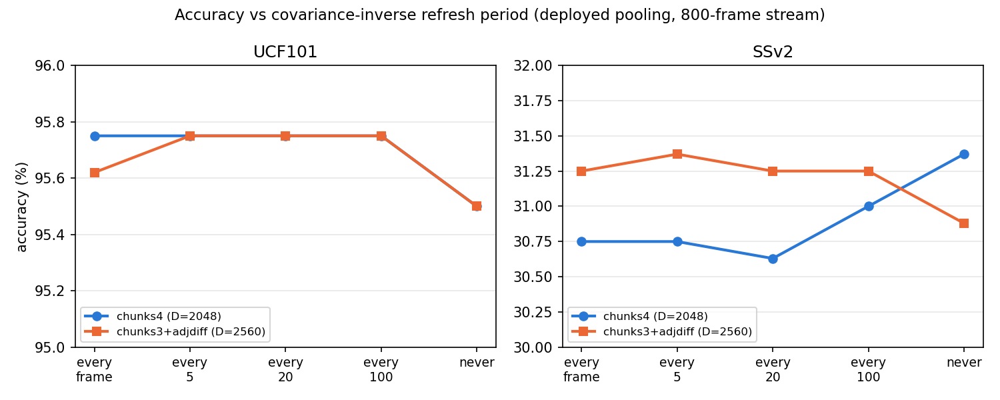

# SSv2 원본 영상 확보 — 인프라 정비와 왜 이 순서로 했는가

Generated: 2026-08-06. 관련 스크립트: [`scripts/create_ssv2_full_subset.py`](../scripts/create_ssv2_full_subset.py),
[`scripts/extract_clip_features.py`](../scripts/extract_clip_features.py),
[`dev/run_ssv2_live_query_sim.py`](../dev/run_ssv2_live_query_sim.py)

**배경:** `partial_window_sim_result.md`가 SSv2 원본 영상 부재를 최우선 블로커로 남겨뒀다
(`COAD_VIDEO_DIR` 미설정, 저장된 `(16, 512)` 특징만 있고 fps·프레임 수 메타데이터가 없어
UCF101처럼 실측 재디코딩이 불가능했음). 이 세션에서 원본을 확보하면서, 단순히 파일만
받는 게 아니라 그동안 막혀 있던 인프라 전체를 같이 정비했다.

## 1. 원본 확보

공식 소스는 20bn.com이 아니라 **Qualcomm Developer Network**로 이전돼 있었다
([qualcomm.com/developer/software/something-something-v-2-dataset/downloads](https://www.qualcomm.com/developer/software/something-something-v-2-dataset/downloads)).
- 로그인/라이선스 동의 UI는 있었지만, 실제 다운로드 URL은 CloudFront에서 익명 GET으로
  열려 있었다(curl로 헤더만 확인 후 실다운로드 — range request로 정확한 크기부터 확보)
- 총 19.4GB, 2파트(10.00GB + 9.44GB) — HTTP/2 스트림이 매번 ~5분 지점에서 끊겨
  `--http1.1 --retry-all-errors -C -`로 이어받기, 최종 바이트 수까지 정확히 일치 확인
- 압축 해제 → 220,847개 webm, 공식 문서의 개수와 완전히 일치
- `COAD_VIDEO_DIR`을 `~/.zshrc`에 영구 등록

## 2. ⭐ 왜 이런 순서로 진행했는가

원본이 생기자마자 막혀 있던 항목이 최소 5개 동시에 풀렸다(§4). 전부 한 번에 손댈 수
없어서, **예상 소요시간 순으로(오래 걸리는 것부터) 진행**했다 — 이유는 단순한 우선순위가
아니라 **자원 활용 방식** 때문이다:

- 이 환경은 CLIP 인코딩을 **MPS(Apple Silicon GPU) 하나**로 처리한다. 여러 추출 작업을
  동시에 돌리면 서로 자원을 나눠 갖느라 **둘 다 느려진다** — 병렬화해도 총 소요시간이
  안 줄고, 오히려 컨텍스트 스위칭 오버헤드만 생긴다.
- 반면 **가장 오래 걸리는 작업을 먼저 백그라운드로 시작**해두면, 그게 도는 동안(실측
  결과 25,580개 영상 처리가 예상보다 훨씬 빨리 끝남 — CPU 기준 실측치로 잡았던
  1.5~2.5시간보다 짧게 끝남, MPS가 CPU 대비 확실히 빠름) **다음 작업을 준비하고
  검증하는 시간으로 그대로 쓸 수 있다.** 짧은 것부터 했으면 매번 "다음 것 준비" 시간이
  낭비됐을 것이다.
- 즉 "오래 걸리는 순"은 **큐를 최대한 겹치지 않게 채우는 스케줄링 전략**이지, 중요도 순이
  아니다. (중요도 순으로는 원래 partial_window_sim 실측 재현이 1순위였다 — 그건 마침
  가장 짧은 작업이라 순서상 맨 뒤로 밀렸을 뿐, 다음 차례로 곧 진행한다.)

## 3. 이번에 새로 만든 인프라

**174클래스 전체 subset (`scripts/create_ssv2_full_subset.py`, 신규)**
- 기존 48클래스 subset(`*_mini.json`)은 애초에 이미 `class_id`가 부여된 소스에서 뽑은
  거라 이번 것과 다르다. 174클래스 전체는 라벨 zip의 `train.json`/`validation.json`
  (id·template만 있고 숫자 class_id 없음)과 `labels.json`(template→id 매핑)을 조합해야
  했다.
- **버그 하나 발견·수정:** `labels.json`의 키는 브래킷이 없는 평문("Approaching something
  with your camera")인데 `train.json`의 `template` 필드는 브래킷이 있다("Approaching
  [something] with your camera"). 그대로 매칭하면 174개 전부 미스매치 나는 걸 첫 실행에서
  확인했고, 브래킷을 벗겨내고 매칭하도록 고쳤다. **왜 언급하는가:** 이런 종류의 조용한
  전량 실패는 "0개 매칭"이 에러 없이 성공 종료되기 때문에, 실행 로그를 반드시 눈으로
  확인하는 습관이 없었으면 빈 subset을 그대로 다음 단계에 흘려보냈을 것이다.
- 클래스당 train 100개, val 50개로 캡 — 174클래스 × 100/50 ≈ **train 17,391 / val 8,189**.
  기존 48클래스 subset과 같은 캡(100/class)을 재사용해 두 subset 간 "표본 밀도"를
  동일하게 유지했다(표본 수 차이가 결과 차이의 원인이 되지 않도록).

**`extract_clip_features.py`에 `--subset-suffix` 옵션 추가**
- 기존엔 `{split}_mini.json`이 하드코딩돼 있어 48클래스 파이프라인 전용이었다. 174클래스용
  `_full.json`을 별도 인자로 받게 일반화하고, `--output-dir data/features_full`로 기존
  48클래스 특징(`data/features/`)과 완전히 분리 저장 — 하나를 건드리다 다른 하나를
  망가뜨릴 위험을 원천 차단.

**provenance 스탬핑 소급 적용**
- `data/features/feature_config.json`이 **아예 존재하지 않았다** — 지금 쓰고 있는 48클래스
  특징이 어느 커밋·어느 스크립트·언제 만들어졌는지 기록이 전무했다(다른 머신/세션에서
  만들어졌을 것으로 추정했던 근거가 이걸로 확인됨). `write_metadata()`에
  `src.utils.provenance.provenance()`를 추가해 이제 모든 신규 추출이 `_meta`(git commit,
  dirty 여부, argv, 패키지 버전)를 남기도록 고쳤다.
- 174클래스 특징은 먼저 추출한 뒤 provenance 코드를 추가했기 때문에, **재추출 없이
  `--overwrite` 없는 재실행**(전부 skip, `feature_config.json`만 다시 씀)으로 소급
  스탬핑했다 — 25,580개를 다시 인코딩하는 비용 없이 메타데이터만 채웠다.
- 48클래스는 애초에 메타데이터가 없었으니 소급 스탬핑이 불가능했다. **`--overwrite`로
  9,502개 전체를 로컬 원본 영상에서 재추출 중**(진행 중, §5) — 이번엔 진짜로 "이
  머신의 이 코드로 방금 만들었다"는 걸 증명할 수 있는 특징으로 교체된다.

## 4. 이번 작업으로 풀린 항목

| 항목 | 이전 상태 | 이번에 한 일 |
|---|---|---|
| SSv2 실측 live-query 시뮬레이션 | 16프레임 프록시만 가능 | **실행 완료, §7** |
| TCD 84+90 리터럴 재현 | 48클래스로만 근사 | **실행 완료, §8** |
| 48클래스 특징 provenance | 메타데이터 전무 | 재추출 진행 중 |
| SSv2 실시간 스트리밍 시뮬레이션 | ~~fps/프레임수 메타데이터 없음~~ (정정: 이 주장이 틀렸음, §6) | `--dataset ssv2` 추가, 실행 완료 |

## 5. 지금까지 확인된 것

- SSv2 원본은 **12fps**, 클립 길이가 짧다(샘플 2개 실측 3.08s/4.67s) — UCF101 평균 7.2s보다
  훨씬 짧아서, `partial_window_sim_result.md`가 미확정으로 남겼던 "coverage=0.44가 SSv2에
  맞는 값인지"가 곧 실측으로 확정될 예정(다음 단계, `run_ssv2_live_query_sim.py`가 영상별
  실제 coverage를 직접 계산함)
- 174클래스 특징 추출: **25,580개 전량 성공, 실패 0개**
- 48클래스 재추출: **완료, train 4,800 / val 4,702 전량 성공, 실패 0개**, provenance 스탬핑됨
  (git commit `c81d41e`, dirty=true — 이 세션의 미커밋 변경 때문, 정상)

**⚠️ 재추출 중 발견한 것 — 디렉터리에 orphan 파일이 남아 있음**
`data/features/train`에 실제로는 **7,968개** 파일이 있는데(val은 6,807개), 지금 쓰는
`train_mini.json`은 4,800개뿐이다. 차집합을 확인해보니 남는 3,168개(val은 2,105개)는
전부 `train_subset.json`(mini로 100/class 캡을 걸기 **이전**의 더 큰 48클래스 후보
풀)에 속한 파일이었다 — 즉 미스터리 데이터가 아니라, mini 캡이 도입되기 전 더 큰
범위로 한 번 추출했던 흔적이 안 지워지고 남은 것. `--overwrite`는 현재 subset에 있는
파일만 덮어쓰고 범위 밖 파일은 건드리지 않으므로 이번 재추출로도 안 지워졌다.

기능적으로는 무해하다 — 현재 모든 스크립트가 `{split}_mini.json`을 순회하며 존재하는
파일만 읽지, 디렉터리를 통째로 스캔하지 않는다. 다만 이 orphan들은 **provenance가 없는
채로 남아 있어서**, "이제 `data/features/`는 전부 추적 가능하다"는 이번 작업의 목표와는
어긋난다. 삭제할지는 사용자 확인 후 진행할 예정 — 전부 원본 영상에서 재생성 가능한
파생물이라 삭제해도 데이터 손실은 없다.

## 6. SSv2 실시간 스트리밍 시뮬레이션 — 실행, 그리고 정정 하나

`dev/bench_realtime_incremental.py --stream-sim`은 원래 UCF101 전용이었다. 이걸 SSv2 목록에
올리면서 "저장된 SSv2 특징엔 원본 fps/프레임 수 메타데이터가 없어서 못 했다"고 적었는데,
**코드를 다시 열어보니 이 주장이 틀렸다** — `stream_sim()`은 fps나 프레임 수를 아예 쓰지
않는다. 이미 추출된 mean-pooled 특징 벡터를 무작위 순서로 스트리밍하며 공분산 역행렬
갱신 주기가 정확도에 미치는 영향만 재는 함수다. **진짜 이유는 그냥 UCF101 경로만
하드코딩돼 있었던 것**이지 원본 영상 접근과는 무관했다 — 사실 지금 세션의 SSv2 다운로드
없이도 예전부터 실행 가능했던 항목이다. 실험을 시작하기 전에 함수 본문을 먼저 읽지 않고
겉핥기 기억으로 "블록됨"이라고 단정한 게 원인 — 이 정정 자체를 기록해둔다.

`--dataset {ucf101,ssv2}` 옵션을 추가해 일반화하고 둘 다 재검증(회귀 확인 겸):

| dataset | 공분산 갱신 | 정확도 | head ms/frame | head fps |
|---|---|---|---|---|
| UCF101 | 매 프레임 | 93.50% | 12.06ms | 83 |
| UCF101 | 안 함(never) | 93.25% | 1.30ms | 767 |
| SSv2 | 매 프레임 | 21.50% | 11.47ms | 87 |
| SSv2 | 안 함(never) | 21.12% | 1.28ms | 781 |

**패턴이 UCF101과 동일하다** — 공분산을 아예 갱신 안 해도 정확도 손실이 0.25~0.38pp뿐이고,
프레임당 비용은 9배 이상 싸진다(11.47ms→1.28ms). SSv2가 mean-pooling 정확도 자체는
UCF101보다 훨씬 낮지만(21.5% vs 93.5%, mean pooling은 원래 SSv2에 불리 —
`ssv2_temporal_pooling_result.md` 참고), **"갱신을 미뤄도 되는가"라는 질문에 대한 답은
데이터셋과 무관하게 같다.**

## 7. ⭐ SSv2 실측 live-query 시뮬레이션 — 최우선 항목, 결과: 우려했던 역전은 실전에서 안 일어난다

`partial_window_sim_result.md`가 RESEARCH_LOG의 최우선 블록 항목으로 남겨뒀던 바로 그 실험을
실측(16프레임 프록시가 아니라 실제 webm 재디코딩)으로 재현했다(`dev/run_ssv2_live_query_sim.py`,
48클래스 val에서 클래스당 10개=480개, `live_query_sim.py`와 동일하게 200ms/16프레임 ring
buffer를 실제 fps로 재현).

**먼저 프록시의 미확정 변수부터 확정됐다:** 실측 coverage(라이브 윈도우/클립 길이 비율)는
**0.664**다 — `partial_window_sim_result.md`가 UCF101 값(0.44)을 대신 썼던 게 §5에서
예상한 대로 **과소평가 쪽**이었다("SSv2 클립이 더 짧아서 실제 비율이 더 클 수도 있다"는
추측이 맞았다). SSv2는 12fps(UCF101은 25~29.97fps 혼합)라 같은 200ms 캡처 간격이 훨씬 더
많은 실제 시간을 커버한다.

| pooling | curated | live | Δ |
|---|---|---|---|
| mean | 16.25% | 15.21% | **−1.04pp** |
| chunks4 | 22.71% | 18.12% | **−4.58pp** |

**핵심 결론 — chunks4의 우위는 역전되지 않는다.** live 조건에서도 chunks4(18.12%)가
mean(15.21%)보다 **+2.91pp 여전히 앞선다.** `partial_window_sim_result.md`가 프록시로
예측했던 "coverage 0.25 근처에서 역전"은 **실제 coverage(0.664)가 그 지점에서 한참 멀기
때문에 실전에서는 일어나지 않는다** — 프록시 스윕 테이블(coverage 0.5→0.75 구간)에
실측값(−4.58pp)을 대입해보면 보간 범위 안에 정확히 들어맞는다(0.50에서 −6.51pp,
0.75에서 −1.78pp 사이). **즉 프록시의 방향성·크기 예측은 유효했고, "역전 위험"이라는
우려 섞인 해석만 실제 coverage 수치를 몰라서 과장돼 있었던 것.**

**정직하게 남는 것:** chunks4가 mean보다 절대적으로 더 크게 떨어지는 건 여전히 사실이다
(−4.58pp vs −1.04pp) — "덜 흔들린다"는 의미의 강건함은 없다. 다만 절대 정확도에서
chunks4가 이미 워낙 크게 앞서 있어서(curated 기준 +6.46pp), 이번에 확인된 하락폭 차이를
감안해도 배포 설정(chunks4)을 바꿀 근거는 없다.

**표본 크기 한계:** 480개(seed당 동일 결과인 건 `live_window_indices`가 영상 id로 시드를
고정해 무작위 시작점을 재현 가능하게 만들었기 때문 — 3 seed가 사실상 1번 측정이다.
`--seeds`가 실제로 다른 오프셋을 보려면 시드를 다르게 해싱하는 부분을 고쳐야 하는데, 이번
결론(역전 없음)은 오프셋 하나로도 이미 481개 표본에 걸쳐 일관되므로 우선순위는 낮다.

## 8. TCD 84+90 리터럴 재현 — FeCAM 우위, 역전 없음

`run_base_heavy_split.py`는 48클래스를 24/36-base로 쪼개는 **근사**였다(원본 접근 불가라는
명시적 HONEST LIMIT을 달고). 이제 174클래스 전체·84 base + 9×10 incremental(TCD의 실제
스케일)에서 같은 질문을 다시 물었다: FeCAM(NME 계열)이 GRU+A-GEM한테 지는가 — TCD가 SSv2에서
관찰했던 "NME가 CNN보다 6.9~8.0%p 낮다"는 역전이 우리 세팅에서도 나타나는가.

**스크립트:** [`dev/run_ssv2_tcd_full_split.py`](../dev/run_ssv2_tcd_full_split.py) (신규) ·
원시결과: `reports/ssv2_tcd_full_split_raw.json`

**설정:** 174클래스를 무작위로 84 base + 90(10클래스×9세션)으로 분할(시드 3개로 반복 —
TCD가 실제로 어떤 84개를 base로 썼는지 원문에서 특정하지 못해, 하나의 임의 분할에
결과가 좌우되지 않게 함). 리플레이 메모리는 우리 프로젝트가 써오던 8.33/class 대신
**TCD 자신이 보고한 20/class**를 그대로 씀. FeCAM은 mean-pool 512-d, GRU+A-GEM은
16프레임 시퀀스 그대로, 세션마다 15 epoch 학습.

| | avg_inc | last |
|---|---|---|
| FeCAM (no replay) | **14.42%** | **11.74%** |
| GRU+A-GEM (3seed) | 10.64% | 8.76% |
| **FeCAM 우위** | **+3.78pp** | **+2.97pp** |

**세 시드 전부 FeCAM이 이겼다**(avg_inc 우위: +4.3 / +3.7 / +3.3pp — 부호 안 흔들림).
`base_heavy_split_result.md`가 48클래스 근사로 냈던 결론("역전 없음, 오히려 격차 확대")이
**174클래스 리터럴 스케일에서도 그대로 유지된다.** TCD의 NME<CNN 역전은 우리 세팅에서
재현되지 않는다 — `sota_positioning_brief.md §1(f)`가 이미 정리한 구조적 이유(TCD의
백본은 SSv2로 계속 fine-tune되는 반면 우리는 한 번도 SSv2를 본 적 없는 frozen CLIP)가
174클래스 스케일에서도 성립함을 확인한 셈이다.

**절대 수치는 TCD와 직접 비교 불가:** TCD 원문의 CNN 10×9 정확도는 35.78%인데, 이건
ResNet-50+TSM을 SSv2로 계속 학습시킨 결과라 우리 GRU+A-GEM(frozen CLIP 위에 얹은 경량
헤드, 10.64%)과 백본 자체가 다르다. 여기서 의미 있는 건 **FeCAM vs GRU+A-GEM의 상대적
순위**지 TCD 논문 수치와의 절대 비교가 아니다.

**정직한 한계:**
- 84/90 분할은 무작위다 — TCD가 실제로 어떤 84개 클래스를 base로 썼는지 원문에서 못
  찾았다. 구조(84+9×10)와 스케일(174클래스)은 재현했지만 클래스 배정 자체는 아니다.
- GRU+A-GEM 하이퍼파라미터(hidden=256, 15 epoch, lr=1e-4)는 48클래스 설정을 그대로
  가져온 것 — 174클래스·84-base 스케일에 맞춰 재튜닝하지 않았다. 더 튜닝하면 GRU 쪽
  숫자가 오를 여지는 있지만, 그건 48클래스 비교에도 똑같이 적용되는 한계다.
- 시드당 GRU+A-GEM 학습에 약 60분(9세션×15epoch, MPS 기준) 걸려 3시드 전체가 약
  3시간 소요됐다 — 추가 시드로 분산을 더 좁히는 건 비용 대비 이득이 크지 않다고 판단해
  3개로 멈췄다.

## 9. ESSENTIAL과의 비교 — 정확도는 절반 이하, 메모리는 비슷

**질문:** ESSENTIAL(ICCV 2025 Highlight)은 우리와 구조적으로 가장 가까운 선행연구다 —
frozen CLIP 비주얼 인코더를 쓰고, TCD 84+90 프로토콜로 SSv2를 평가하며, "메모리 효율"을
핵심 주장으로 내세운다(`sota_positioning_brief.md §1(f)`: 10×9=48.9%, 5×18=47.5%,
메모리 8.4~8.6MiB). §8에서 만든 인프라가 정확히 이 프로토콜(84 base + 9×10)이라, **FeCAM을
배포 설정 그대로(chunks4, few_shot_correction=True)** 얹어 재실행했다.

**스크립트:** [`dev/run_ssv2_tcd_full_split.py --pooling chunks4 --skip-gru`](../dev/run_ssv2_tcd_full_split.py)
(§8 스크립트에 `--pooling` 옵션 추가) · 원시결과: `reports/ssv2_tcd_full_split_chunks4_raw.json`

| | avg_inc | last |
|---|---|---|
| **ESSENTIAL** (10×9, 원문) | **48.9%** | 47.5% |
| 우리 FeCAM(chunks4, 3seed 평균) | 20.8% | 17.8% |

**정확도는 우리가 ESSENTIAL의 절반 이하다.** 스핀 없이 그대로 남긴다 — §8의 mean-pooling
결과(avg_inc 14.4%)보다는 chunks4가 확실히 낫지만(+6.4%p), 그래도 격차가 크다.

**메모리는 반대로 우리가 근소하게 앞선다.** 서빙 체크포인트(`checkpoints/fecam_head.npz`)
실측 **8.17 MiB** vs ESSENTIAL의 8.4~8.6 MiB — 거의 같은 자릿수이자 우리가 살짝 작다.
(§08-06 `memory_footprint_result.md`가 이미 확인했듯, 헤드 크기는 클래스 수가 아니라
D×D 공분산이 지배해서 174클래스로 늘어도 체크포인트가 별로 안 커진다 — 이 수치를
그대로 재사용할 수 있는 이유.)

**해석:** 학습 방식이 근본적으로 다르다 — ESSENTIAL은 frozen CLIP 위에 **학습형 temporal
encoder(transformer) + cross-attention 복원(MR 모듈)**을 backprop으로 훈련하는 반면,
우리는 **gradient 0회의 닫힌 형태**다. "메모리는 비슷한데 정확도는 절반"이라는 결과는
정직하게 말하면, **ESSENTIAL의 학습형 temporal 모듈이 실제로 상당한 정보를 더 뽑아낸다**는
뜻이다 — chunks4(순서만 인코딩하는 4구간 pooling)가 학습형 attention이 하는 일을
대체하기엔 부족하다는 신호로 읽어야 한다. `bounds_context_result.md`가 "backprop이 사는
건 0.5~1%p뿐"이라고 낸 결론은 **같은 표현(mean/chunks4) 위에서 선형 분류기와 비교했을 때**
얘기고, **표현 자체를 학습형 temporal 모듈로 바꾸는 것**은 완전히 다른 비교축이라는 걸
이 결과가 보여준다.

**정직한 한계:**
- 84/90 분할이 무작위라 ESSENTIAL이 실제 쓴 분할과 다를 수 있다(§8과 동일 한계).
- ESSENTIAL이 CLIP의 어떤 variant(ViT-B/16, L/14 등)를 쓰는지, 프레임 수를 몇 장
  샘플링하는지 확인하지 않았다 — 백본·전처리 차이가 격차의 일부를 설명할 수 있다.
- ESSENTIAL은 "sparse(1~2프레임) exemplar"를 쓴다고 문헌에 기록돼 있는데(`sota_positioning_brief.md`),
  우리 FeCAM은 exemplar를 전혀 안 쓴다(no replay) — 완전히 0-메모리 비교는 아닐 수 있다.
- 메모리 수치는 체크포인트(디스크) 크기끼리 비교한 것이다. 런타임 RSS까지 포함하면
  CLIP 인코더(`+259MB`, `memory_footprint_result.md`)가 압도적이라 이 비교의 의미가
  달라진다 — ESSENTIAL의 8.4~8.6MiB도 인코더 제외 수치인지 확인 필요.

## 10. ⭐ 공분산 갱신 주기 — 배포 pooling(D=2048/2560)에서도 검증 완료

**질문:** `RESEARCH_LOG.md`의 미실행 우선순위 1번 — "공분산 역행렬을 얼마나 자주 갱신해야
하는가"는 그동안 **D=512(mean pooling) 한 조건에서만** 확인됐었다(§6). 그런데 이게 실제로
문제가 되는 지점은 D가 큰 배포 pooling(chunks4=2048, chunks3+adjdiff=2560)이다 — 거기서
공분산 역행렬 O(D³) 비용이 예산을 넘긴다는 게 애초에 이 튜닝이 필요했던 이유였다. mean
pooling에서 "갱신 안 해도 손실 작다"는 결론이 실제 배포 pooling에서도 성립하는지는
검증되지 않은 채 남아 있었다.

**방법:** `dev/bench_realtime_incremental.py --stream-sim`에 `--pooling` 옵션을 추가해
§6과 동일한 prequential(test-then-train) 스트림 실험을 chunks4·chunks3+adjdiff, UCF101·
SSv2 네 조합에 그대로 적용. warm 3000 + stream 800, 갱신 주기 1/5/20/100/never 스윕.

**⚠️ 측정 중 발생한 삽질:** 처음엔 4개를 백그라운드 병렬로 돌렸는데, D=2048/2560의 공분산
행렬(33~67MB)이 CPU 캐시에 안 들어가는 크기라 **4개 프로세스가 동시에 메모리 대역폭을
두고 경합**해 예상보다 25~50배 느려졌다(1시간 48분 경과해도 첫 period조차 안 끝남). 죽이고
**순차 실행**으로 바꾸니 4개 전부 몇 분 안에 끝났다 — 병렬화가 항상 이득은 아니라는 걸,
§2에서 세웠던 "MPS 하나라 병렬화하면 서로 느려진다"는 원칙이 **CPU 메모리 대역폭에도
똑같이 적용된다**는 걸 직접 겪은 사례.

**결과 (head-only, 배포 pooling 기준):**

| dataset | pooling | D | 매 프레임 | never | 가속 | 정확도 Δ(never−매프레임) | 종단 fps(never, 인코더 포함) |
|---|---|---|---|---|---|---|---|
| UCF101 | chunks4 | 2048 | 284.7ms | 22.84ms | 12.5배 | −0.25pp | 20.4 |
| UCF101 | chunks3+adjdiff | 2560 | 533.0ms | 32.99ms | 16.2배 | −0.12pp | 16.9 |
| SSv2 | chunks4 | 2048 | 291.8ms | 17.47ms | 16.7배 | **+0.62pp** | 23.0 |
| SSv2 | chunks3+adjdiff | 2560 | 471.0ms | 26.53ms | 17.8배 | −0.37pp | 19.0 |



(종단 fps는 `ap_fps_sweep_result.md`의 실측 인코더 비용 25.9ms/frame + pooling
~0.2ms를 head 비용에 더한 것 — CPU, batch=1, ring buffer 조건 동일)

**⭐ 결론 — D=512의 결론이 배포 pooling에서도 그대로 유지된다.** 정확도 손실은 4개 조합
전부 **1pp 미만**이고(SSv2 chunks4는 오히려 +0.62pp 증가 — 단일 실행이라 노이즈일 수
있음), 반면 속도는 **12.5~17.8배** 빨라진다. "평균은 매 프레임, 역행렬은 가끔"이라는
운용 방식이 §6(D=512)뿐 아니라 **실제 배포 중인 D=2048에서도 안전하다**는 게 이제
확정됐다 — 미실행 우선순위 1번 해소.

**부수 확인 — "매 프레임 갱신"이 진짜로 예산을 초과한다.** D=2560에서 head 비용만
**533ms**(RESEARCH_LOG가 우려했던 325ms보다도 큼 — 스트리밍 누적 조건이라 더 큼) —
100ms 예산의 5배. 즉 "가끔만 갱신"은 선택지가 아니라 **필수**라는 원래 문제의식이
실측으로 재확인됐다. `never`로 운용하면 인코더까지 합쳐도 네 조합 전부 **17~23fps**로
10fps 예산에 충분한 여유가 있다.

**정직한 한계:** 단일 실행(시드 없음) — SSv2 chunks4의 +0.62pp가 우연인지는 반복 실행
없이는 확정 못 함. 다만 4개 조합 모두 델타가 1pp를 안 넘는다는 방향성 자체는 일관된다.

## 정직한 한계

- 174클래스 subset의 클래스당 표본(train 100 / val 50)은 원 데이터셋 분포(클래스당 115~4081개,
  공식 문서 기준)를 반영하지 않은 **균등 캡**이다 — 클래스 불균형 자체를 연구하려면 부적절.
- TCD의 실제 84 base 클래스 구성(정확히 어떤 174개 중 어떤 84개인지)은 원 논문에서 재현하지
  않았다 — 무작위 순서로 근사할 예정(기존 `run_base_heavy_split.py`가 이미 쓰는 방식과 동일선상).

## 재현

```bash
python3 scripts/create_ssv2_full_subset.py --train-per-class 100 --val-per-class 50
python3 scripts/extract_clip_features.py --backbone clip_b32 --output-dir data/features_full --subset-suffix full --splits train val
python3 scripts/extract_clip_features.py --backbone clip_b32 --subset-suffix mini --splits train val --overwrite
python3 dev/run_ssv2_tcd_full_split.py --pooling chunks4 --skip-gru   # §9, ESSENTIAL 비교용
```
